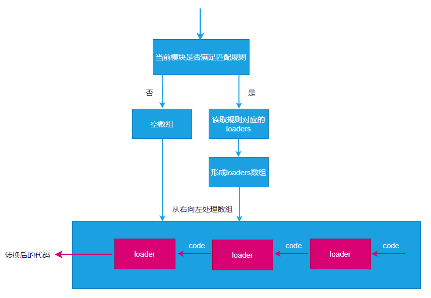

# loader

> webpack 做的事情，仅仅是分析出各种模块的依赖关系，然后形成资源列表，最终打包生成到指定的文件中。
> 更多的功能需要借助 webpack loaders 和 webpack plugins 完成。

## 简介

> webpack loader： loader本质上是一个函数，它的作用是将某个源码字符串转换成另一个源码字符串返回。

```js
module.exports = function (sourceCode) {
  //sourceCode : 变量 a = 1;
  return 'var a = 1;';
};
```


## 运行时间点

> loader函数将在模块解析的过程中被调用，以得到最终的源码。


**处理loaders流程：**



## 配置

**完整配置**

```js
module.exports = {
    module: { //针对模块的配置，目前版本只有两个配置，rules、noParse
        rules: [ //模块匹配规则，可以存在多个规则
            { //每个规则是一个对象
                test: /\.js$/, //匹配的模块正则（正则表达式，匹配模块的路径）
                use: [ //匹配到后应用的规则模块
                    {  //其中一个规则
                        loader: "模块路径", //loader模块的路径，该字符串会被放置到require中 额外的传参方式："模块路径?属性名=属性值"
                        options: { //向对应loader传递的额外参数
														// 属性名：属性值
                        }
                    }
                ]
            }
        ]
    }
}
```

**简化配置**

```js
module.exports = {
    module: { //针对模块的配置，目前版本只有两个配置，rules、noParse
        rules: [ //模块匹配规则，可以存在多个规则
            { //每个规则是一个对象
                test: /\.js$/, //匹配的模块正则
                use: ["模块路径1", "模块路径2"]//loader模块的路径，该字符串会被放置到require中
            }
        ]
    }
}
```

## 额外的补充

> 运行loaders时，传递的额外参数会被注入到上`this`中，由于 this 的结构比较复杂，我们通常使用第三方库 `loader-utils`来读取传递的额外参数

```js
var loaderUtils = require("loader-utils")

module.exports = function(sourceCode){
    var options = loaderUtils.getOptions(this)
    console.log(options) // 输出额外参数
    // ... 
    return 'ending code';
}
```

## 应用

### 样式处理

**./src/assets/index.css**

```css
body{
    background: #333;
    color: #fff;
}
```

**./src/index.js**

```js
const content = require("./assets/index.css");
console.log(content);
```

**webpack.config.js**

```js
module.exports = {
    mode: "development",
    devtool: "source-map",
    module: {
        rules: [{
            test: /\.css$/,
            use: ["./loaders/style-loader"]
        }]
    }
}
```

**==./loaders/style-loader==**

```js
module.exports = function (sourceCode) {
    var code = `var style = document.createElement("style");
    style.innerHTML = \`${sourceCode}\`;
    document.head.appendChild(style);
    module.exports = \`${sourceCode}\``;
    return code;
}
```

### 图片处理

**./src/assets/webpack.png**


**./src/index.js**

```js
var src = require("./assets/webpack.png")
console.log(src);
var img = document.createElement("img")
img.src = src;
document.body.appendChild(img);
```

**webpack.config.js**

```js
module.exports = {
    mode: "development",
    devtool: "source-map",
    module: {
        rules: [
            {
                test: /\.(png)|(jpg)|(gif)$/, use: [{
                    loader: "./loaders/img-loader.js",
                    options: {
                        limit: 3000, //3000字节以上使用图片，3000字节以内使用base64
                        filename: "img-[contenthash:5].[ext]" //contenthash 单个文件的hash
                    }
                }]
            }
        ]
    }
}
```

**==./loaders/img-loader==**

> 图片的二进制数据在3000字节以上使用图片，3000字节以内使用base64

```js
var loaderUtil = require("loader-utils")

function loader(buffer) { //默认接收字符串格式，配置loader的静态属性raw为true 表示接收原始格式(二进制格式)
    console.log("文件数据大小：(字节)", buffer.byteLength);
    var { limit = 1000, filename = "[contenthash].[ext]" } = loaderUtil.getOptions(this); //获取loader传递的额外参数
    if (buffer.byteLength >= limit) { // 3000字节以上使用图片
        var content = getFilePath.call(this, buffer, filename);
    }
    else{
      // 3000字节以内使用base64
        var content = getBase64(buffer)
    }
    return `module.exports = \`${content}\``;
}

loader.raw = true; //该loader要处理的是原始数据

module.exports = loader;

function getBase64(buffer) {
    return "data:image/png;base64," + buffer.toString("base64");
}

function getFilePath(buffer, name) {
    var filename = loaderUtil.interpolateName(this, name, {
        content: buffer
    }); // 利用工具库生成文件名 参数1：loader的this 参数2：生成文件名的规则 参数3：文件内容
    this.emitFile(filename, buffer); // 利用工具库直接输出到最终文件
    return filename;
}
```

