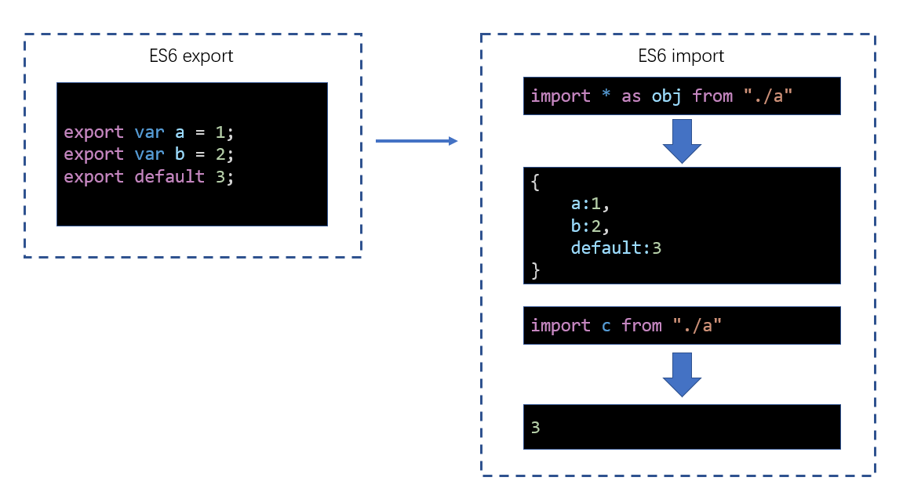

# 模块化兼容性

由于 webpack 同时支持 CommonJS 和 ES module，因此需要理解它们互操作时 webpack 是如何处理的

## 同模块化标准

如果导出和导入使用的是同一种模块化标准，打包后的效果和之前学习的模块化没有任何差异

## 不同模块化标准

不同的模块化标准，webpack按照如下的方式处理

## 最佳实践

代码编写最忌讳的是精神分裂，选择一个合适的模块化标准，然后贯彻整个开发阶段。

## 思考

> 不同模块化之间的导入导出，webpack 会怎么处理？
>
> 1. commonjs 导出 ，es module 方式导入
>
> - 若使用 es module 的默认导入，则导入的是 commonjs 通过 module.exports 导出的内容
> - 若使用 es module 的全部导入，则导入的也是 commonjs 通过 module.exports 导出的内容
>
> 2. es module 方式导出 ，commonjs 导入
>
> - require 的则是封装的一个对象，es module 默认导出的内容则封装到该对象的 default 属性中
