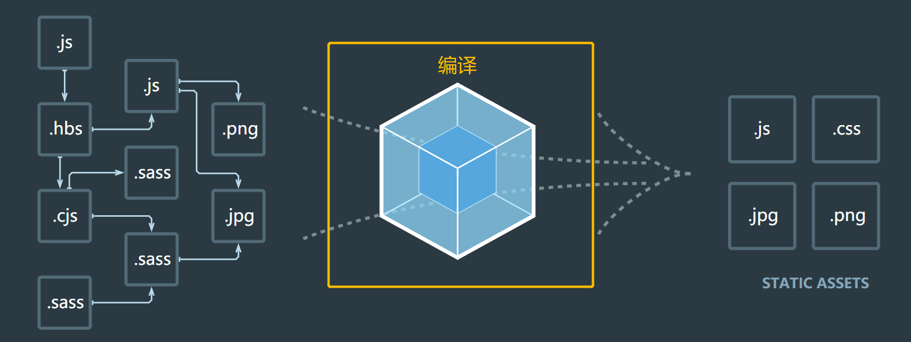
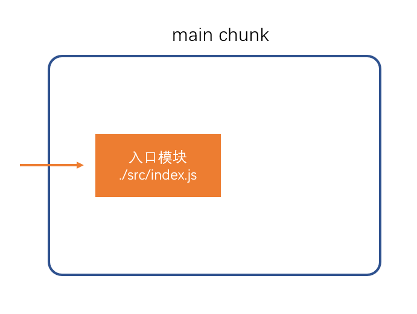
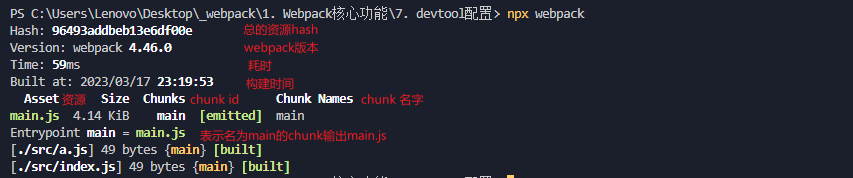

# webpack 编译过程

> webpack 的作用是将源代码编译（构建、打包）成最终代码



整个过程大致分为三个步骤

1. 初始化
2. 编译
3. 输出


## 初始化

此阶段，webpack会将**CLI参数**、**配置文件**、**默认配置**进行融合，形成一个最终的配置对象。

对配置的处理过程是依托一个第三方库```yargs```完成的

此阶段相对比较简单，主要是为接下来的编译阶段做必要的准备

目前，可以简单的理解为，初始化阶段主要用于产生一个最终的 webpack 配置

## 编译

1. **创建chunk**

chunk 是 webpack 在内部构建过程中的一个概念，译为```块```，它表示通过某个入口找到的所有依赖的统称。

根据入口模块（默认为```./src/index.js```）创建一个chunk



每个chunk都有至少两个属性：

- name：默认为main
- id：唯一编号，开发环境和name相同，生产环境是一个数字，从0开始

2. **构建所有依赖模块**


> AST在线测试工具：https://astexplorer.net/

简图


3. **产生chunk assets**

在第二步完成后，chunk中会产生一个模块列表，列表中包含了**模块id**和**模块转换后的代码**

接下来，webpack会根据配置为chunk生成一个资源列表，即```chunk assets```，资源列表可以理解为是生成到最终文件的文件名和文件内容


> chunk hash是根据所有chunk assets的内容生成的一个hash字符串
> hash：一种算法，具体有很多分类，特点是将一个任意长度的字符串转换为一个固定长度的字符串，而且可以保证原始内容不变，产生的hash字符串就不变

简图


4. **合并chunk assets**

将多个chunk的assets合并到一起，并产生一个总的hash


## 输出

此步骤非常简单，webpack将利用node中的fs模块（文件处理模块），根据编译产生的总的assets，生成相应的文件。


## 总过程


**涉及术语**

1. module：模块，分割的代码单元，webpack中的模块可以是任何内容的文件，不仅限于JS
2. chunk：webpack内部构建模块的块，一个chunk中包含多个模块，这些模块是从入口模块通过依赖分析得来的
3. bundle：chunk构建好模块后会生成chunk的资源清单，清单中的每一项就是一个bundle，可以认为bundle就是最终生成的文件
4. hash：最终的资源清单所有内容联合生成的hash值
5. chunkhash：chunk生成的资源清单内容联合生成的hash值
6. chunkname：chunk的名称，如果没有配置则使用main
7. id：通常指chunk的唯一编号，如果在开发环境下构建，和chunkname相同；如果是生产环境下构建，则使用一个从0开始的数字进行编号



## 思考

> webpack 编译过程 ？
>
> webpack 编译过程大致上分为三步，分别是：初始化、编译、输出。
>
> 初始化阶段所做的事儿非常简单，主要用于产生一个最终的 webpack 配置对象。它会将 cli 参数、webpack 配置文件、webpack 默认配置进行融合，形成一个最终的 webpack 配置对象。
>
> 编译阶段所做的事儿相对来说就比较复杂了，其核心目的是为了产生一个资源列表，供输出阶段使用。编译阶段，具体来说的话，大致可以分为三个步骤，依次是：创建 chunk 、构建依赖模块、产生chunk assets也就是资源列表。
> - 创建 chunk ：webpack会为入门模块配置创建对应的chunk，每个chunk至少包含两个属性：name（表示chunk名称，默认为main）、id（表示chunk的唯一编号，开发环境下chunk id 与 chunk name是相同的；生产环境下，chunk id 是一个数字，从0开始）
>
> - 构建依赖模块 ：webpack在内部为每个chunk维护了一个模块列表，我们可以将其理解为一张表格，该表格用于记录模块id和模块转换后的代码。构建依赖模块的本质就是填充模块列表。具体来说，它会从入口模块开始，首先检查模块列表中是否已经记录了对应的模块，如果已经记录了则直接结束；如果没有记录，webpack会读取对应的模块内容，并将其内容转换为AST（抽象语法树），再从抽象语法树中分析出依赖模块，并将依赖模块保存到dependencies（数组）中。然后会替换模块内容中的依赖函数（例如将require替换为_webpack_require函数或export default替换为 _webpack_export[‘default’]），形成转换后的模块代码，并作为模块内容保存至模块列表中。保存的依赖模块数组将递归重复上述步骤，以形成最终的模块列表。
>
> - 产生chunk assets：webpack根据模块列表生成对应的资源列表，资源列表也可以理解为一张表格，其中记录了最终需要生成的文件名和文件内容，同时会附带生成一个chunk hash（利用hash算法将模块列表中记录的所有模块内容的字符串加密为一个固定长度的字符串）
>
如果工程配置了多个webpack入口的话，编译阶段还会多出一个步骤：合并chunk assets。就是将多个资源列表合并为一个，同时附带生成一个总的hash。
>
> 输出阶段所做的事儿也非常简单，无非就是webpack利用node中的fs模块（文件处理模块），根据编译阶段产生的总的资源列表，生成对应的文件。
