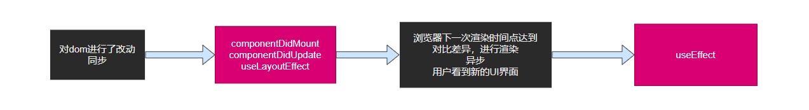

# LayoutEffect Hook

useEffect：浏览器渲染完成后，用户看到新的渲染结果之后
useLayoutEffectHook：完成了DOM改动，但还没有呈现给用户

应该尽量使用useEffect，因为它不会导致渲染阻塞，如果出现了问题，再考虑使用useLayoutEffectHook

**说明**

`useLayoutEffectHook`主要解决的问题：

在开发者需要自行操作dom元素时：

1. 如果在`useEffect`中处理操作dom元素的副作用，会导致页面出现闪烁。因为useEffect运行的时间点在用户看到UI界面之后，再去改动dom的话，则会出现闪烁
2. 然而 `useLayoutEffectHook`运行的时间点在用户看到新的UI界面之前，此时操作dom元素后，用户看到的UI界面不再变化

