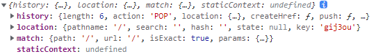

# 路由组件

React-Router 为我们提供了两个重要组件

## Router组件

它本身不做任何展示，仅提供路由模式配置，另外，该组件会产生一个上下文，上下文中会提供一些实用的对象和方法，供其他相关组件使用

1. HashRouter：该组件，使用hash模式匹配
2. BrowserRouter：该组件，使用BrowserHistory模式匹配

通常情况下，Router组件只有一个，将该组件包裹整个页面

## Route组件

根据不同的地址，展示不同的组件

重要属性：

1. path：匹配的路径
   1. 默认情况下，不区分大小写，可以设置sensitive属性为true，来区分大小写
   2. 默认情况下，只匹配初始目录，如果要精确匹配，配置exact属性为true
   3. 如果不写path，则会匹配任意路径
   
2. component：匹配成功后要显示的组件

3. children：
   1. 传递React元素，**如果匹配**，一定会显示children，并且会忽略component、render属性
   
   2. 传递一个函数，该函数有多个参数，这些参数来自于上下文，该函数返回react元素，**无论是否匹配**则一定会显示返回的元素，并且忽略component、render属性
   
      - 参数是一个对象如下：
   
      
   
4. render:传递一个函数 
   1. 该函数有一个参数 为`Route`组件当前所匹配的页面的路由信息{history:…,location:…,match:…}
   2. 该函数的返回值为一个可渲染的React元素，该元素会在`path`匹配成功后显示

**注意**

**优先级：children>component>render,三者只会渲染其一**

Route组件可以写到任意的地方，只要保证它是Router组件的后代元素

## Switch组件

写到Switch组件中的Route组件，当匹配到第一个Route后，会立即停止匹配

由于Switch组件会循环所有子元素，然后让每个子元素去完成匹配，若匹配到，则渲染对应的组件，然后停止循环。因此，不能在Switch的子元素中使用除Route外的其他组件。