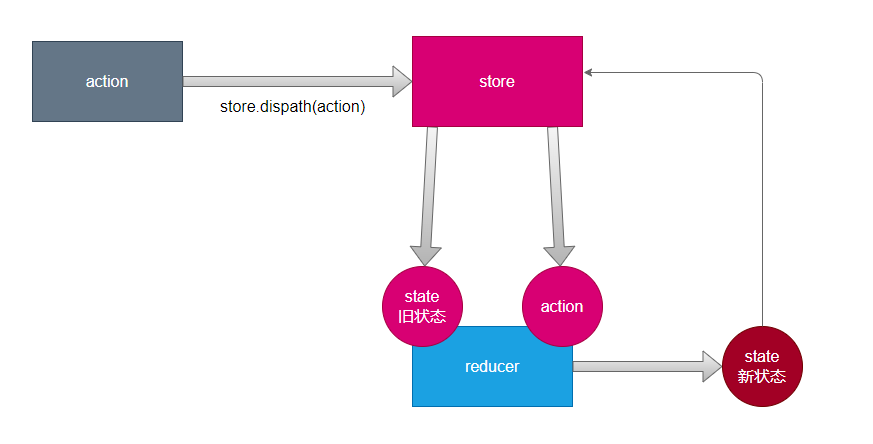

# 使用Redux管理数据



## Redux使用

[createStore(废弃问题)](https://juejin.cn/news/7090151503251374093)

```js
import { createStore } from 'redux';
//约定 仓库仅存放一个数字 7
// action 格式：{type:"操作类型"，payload:附加信息}

/**
 *
 * @param {*} state 仓库中旧的状态
 * @param {*} action 普通对象，描述了行为
 */
function reducer(state, action) {
  if (action.type === 'increase') {
    return state + 1;
  } else if (action.type === 'decrease') {
    return state - 1;
  } else {
    return state; //无效的操作类型保持旧数据
  }
}

//创建一个仓库
//传入reducer使仓库持有该reducer引用 并给仓库数据赋以初值7
const store = createStore(reducer, 7);

//创建一个action
const action = {
  type: 'increase',
};

store.dispatch(action); //分发一个action

console.log(store.getState()); //store.getState()获取仓库数据
```

