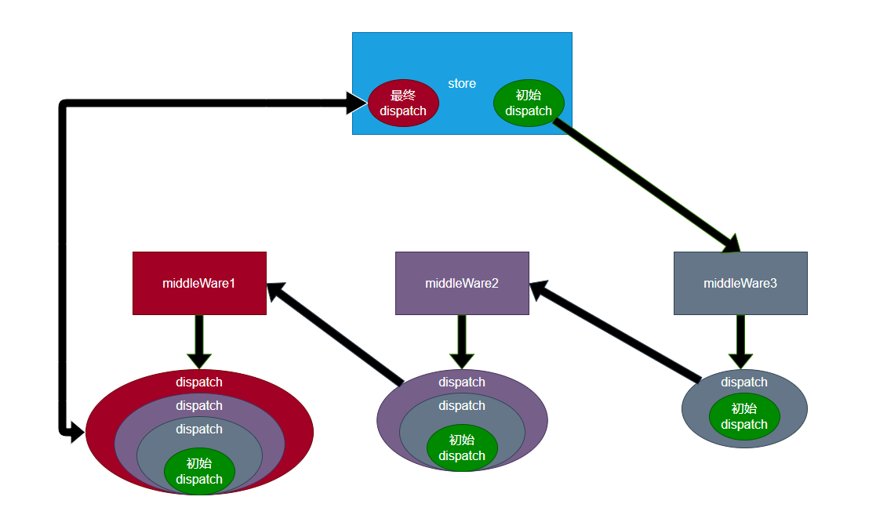

# Redux中间件（Middleware）

## 概述

中间件：类似于插件，可以在不影响原本功能、并且不改动原本代码的基础上，对其功能进行增强（功能扩展点）。在Redux中，中间件主要用于增强dispatch函数。

## 核心

**实现Redux中间件的基本原理，是更改仓库中的dispatch函数**。

**举个栗子：如果把最初的dispath想象成一个空盘子的话，那它大概需要如下中间件：**

- 中间件1：切水果装盘
- 中间件2：加入酸奶

**最终产出一个水果拼盘，期间不同的中间件各司其职、互不影响**

## 书写

Redux中间件书写：

- 中间件本身是一个函数，该函数接收一个store参数，表示创建的仓库，该仓库并非一个完整的仓库对象，仅包含getState，dispatch。该函数运行的时间，是在仓库创建之后运行。
  - 由于创建仓库后需要自动运行设置的中间件函数，因此，需要在创建仓库时，告诉仓库有哪些中间件
  - 需要调用applyMiddleware函数，将函数的返回结果作为createStore的第二或第三个参数。
- 中间件函数必须返回一个dispatch创建函数

```js
//中间件本身是一个函数，该函数接收一个store参数，表示创建的仓库，该仓库并非一个完整的仓库对象，仅包含getState，dispatch
//该函数运行的时间，是在仓库创建之后运行。
function middleWare(store) { 
  return function (dispatch) { //返回一个dispatch创建函数
      return function (action){ //这个函数就是dispath函数
        console.log('old-state============>',store.getState());
        dispatch(action);
        console.log('new-state============>',store.getState());
      }
  };
}

//创建一个仓库 传入一个reducer
const store = createStore(reducer, applyMiddleware(middleWare)); //需要调用applyMiddleware函数，将函数的返回结果作为createStore的第二或第三个参数。若需要使用第二个参数赋给仓库状态赋初值，applyMiddleware函数作为第三个参数
```

### 书写多个中间件函数

#### 原理图

**核心：这里把最初的dipatch优先交给最后一个中间件处理，是因为执行的时候它是反着来的，如图中我们得到的最终的dispatch，它是由外即里运行函数**



#### 代码实现

**初级**

```js
function middleWare1(store) {
  return function (next) { //这里我们把dispatch写作next：是因为该处的dispatch是下一个（后一个）中间件传递过来的
    return function (action) {
      console.log('old-state============>', store.getState());
      next(action);
      console.log('new-state============>', store.getState());
    };
  };
}

function middleWare2(store) {
  return function (next) {
    return function (action) {
      console.log('action============>', action);
      next(action);
    };
  };
}

//创建一个仓库 传入一个reducer
const store = createStore(reducer, applyMiddleware(middleWare1, middleWare2));
```

**最终版本，利用箭头函数书写中间件**

```js
const middleWare1 = (store) => (next) => (action) => { //dispatch写作next：是因为该处的dispatch是下一个（后一个）中间件传递过来的
  console.log('old-state============>', store.getState());
  next(action);
  console.log('new-state============>', store.getState());
};

const middleWare2 = (store) => (next) => (action) => {
  console.log('action============>', action);
  next(action);
};
//创建一个仓库 传入一个reducer
const store = createStore(reducer, applyMiddleware(middleWare1, middleWare2));
```


### 利用applyMiddleware函数创建仓库


- applyMiddleware函数，用于记录有哪些中间件，它会返回一个函数
  - 该函数用于记录创建仓库的方法（因此这个函数我们传递的参数为`createStore`），然后又返回一个函数(这个函数的参数，即为我们传入的创建仓库的方法`createStore`函数的参数)

```js
//在使用中间件的情况下，以下两种方式均可创建一个仓库 使用方式1创建仓库的本质其实也是通过方式2创建一个仓库
//1.
const store = createStore(reducer, applyMiddleware(middleWare1, middleWare2));
//2.
const store = applyMiddleware(middleWare1, middleWare2)(createStore)(reducer);
```

