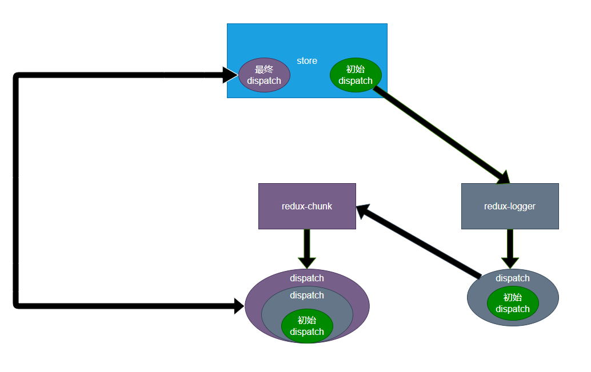

# redux-thunk

npm链接:   [redux-thunk](https://www.npmjs.com/package/redux-thunk)

**thunk允许action是一个带有副作用的函数，当action是一个函数被分发时，thunk会阻止action继续向后移交**。

（副作用一般在action中处理，reducer保持纯净）

thunk会向函数中传递三个参数：
- dispatch：来自于store.dispatch

- getState：来自于store.getState

- extra：来自于用户设置的额外参数

  - 配置第三个参数的方式(此时第三个参数被配置为123，会传递到下个代码块中的extra处)

    ```js
    import { createStore, applyMiddleware } from 'redux';
    import reducer from './reducer';
    import logger from 'redux-logger';
    import chunk from 'redux-thunk';
    
    export default createStore(
      reducer,
      applyMiddleware(chunk.withExtraArgument(123), logger)
    );
    ```

    


**dispatch封装过程：**




**执行dispatch（由外即里）：**


## 使用

**一个特殊的action，返回一个函数，该函数内部可以进行副作用操作**

```js
//actionCreators.js

export function fetchUsers() {
  return async function (dispatch,getState,extra) { //第三个参数不常用（上文代码的的123会传递到这里）
    dispatch(createisLoadingAction(true));
    const result = await getMoviesByPage(1, 10);
    dispatch(createInitUsersAction(result.movieList));
    dispatch(createisLoadingAction(false));
  };
}
```

**触发函数类型的action，即运行该action**

```js
import store from './index';
import * as allUsersActionCreators from './action/allUsers/actionCreator';

const result = store.dispatch(allUsersActionCreators.fetchUsers()); //返回值即为运行函数类型action的返回值
console.log(result); //由于上个代码块中函数类型的action被标记为async 所以此处为Promise
```

