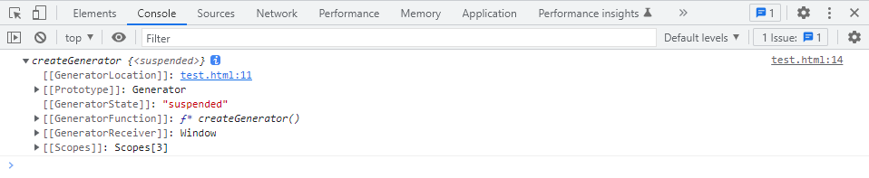
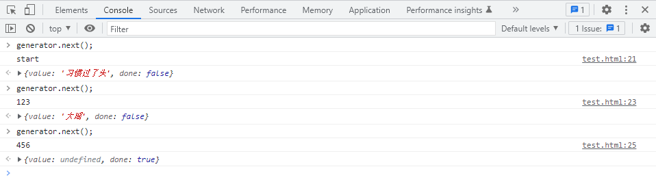
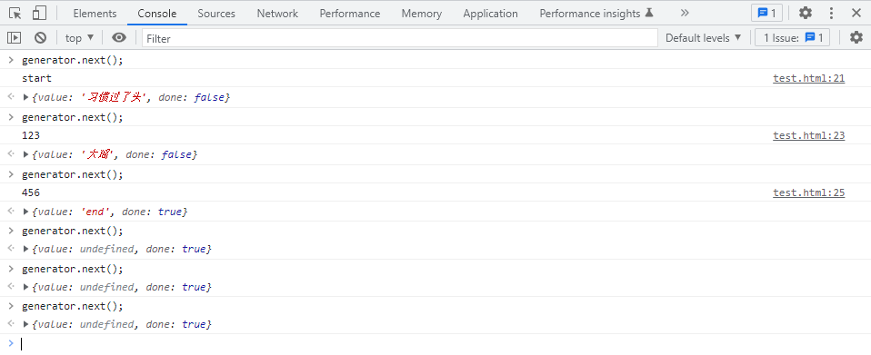
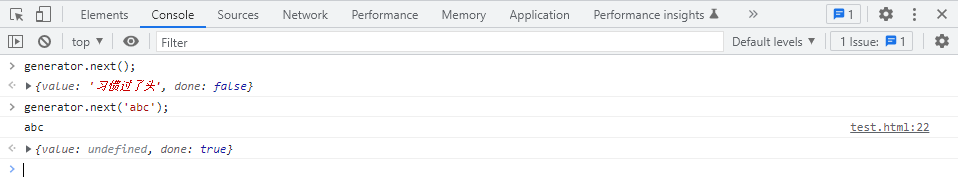
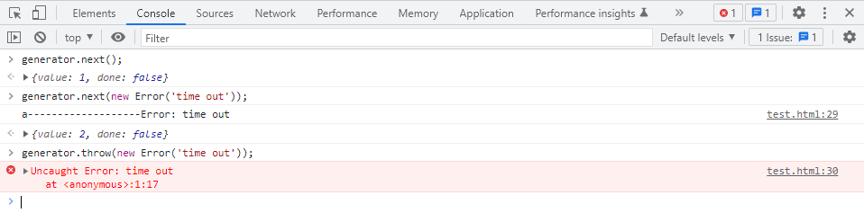
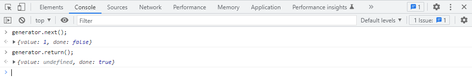
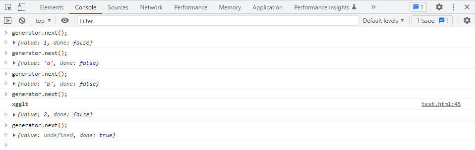

# 生成器 generator

**习惯过了头:生成器既是迭代器，也是一个满足可迭代协议的对象。生成器的出现，给予了开发者更多的能力，以至于开发者可以在生成器创建函数外部，自行控制生成器创建函数内部的执行（暂停、报错等）**

## generator

生成器：由构造函数Generator创建的对象，该对象既是一个迭代器，同时，又是一个可迭代对象（满足可迭代协议的对象）

```js
//伪代码

var generator = new Generator();
generator.next();//它具有next方法
var iterator = generator[Symbol.iterator];//它也是一个可迭代对象
for(const item of generator){
    //由于它是一个可迭代对象，因此也可以使用for of循环
}
```

**注意：Generator构造函数，不提供给开发者使用，仅作为JS引擎内部使用**

## generator function 

生成器函数（生成器创建函数）：该函数用于创建一个生成器。

ES6新增了一个特殊的函数，叫做生成器函数，只要在函数名与function关键字之间加上一个*号，则该函数会自动返回一个生成器

*例如：*

```js
function* createGenerator() {}

const generator = createGenerator();
console.log(generator);
```

*控制台截图如下：*



### 生成器函数的特点：

1. 调用生成器函数，会返回一个生成器，而不是执行函数体（因为，生成器函数的函数体执行，受到生成器控制）

   *例如：*

   ```js
   function* createGenerator() {
     console.log('函数运行'); //此处代码不会输出到控制台
   }
   const generator = createGenerator(); //仅返回一个生成器，不会运行函数体
   ```

2. 每当调用了生成器的next方法，生成器函数的函数体会从上一次yield的位置（或开始位置）运行到下一个yield，并将yield关键字后面附着的表达式的返回结果作为该次迭代的数据（即value属性值）
   1. yield关键字只能在生成器函数内部使用，不可以在普通函数内部使用
   2. 它表示暂停，并返回一个当前迭代的数据
   3. 如果没有下一个yield，并且到了函数结束，则生成器的next方法得到的结果中的done为true

   *例如：*

   ```js
   function* createGenerator() {
     console.log('start');
     yield '习惯过了头';
     console.log('123');
     yield '大瑶';
     console.log('456');
   }
   
   const generator = createGenerator();
   ```

   *控制台调试结果如下：*

   

3. yield关键字后面的表达式返回的数据，会作为当前迭代的数据

4. 生成器函数的返回值，会作为迭代结束时的value
   1. 但是，如果在结束过后，仍然反复调用next，则value为undefined

   *例如：*

   ```js
   function* createGenerator() {
     console.log('start');
     yield '习惯过了头';
     console.log('123');
     yield '大瑶';
     console.log('456');
     return 'end';
   }
   
   const generator = createGenerator();
   ```

   *控制台调试结果如下：*

   

5. 生成器调用next的时候，可以传递参数，该参数会作为生成器函数体上一次yield表达式的值。
   1. 生成器第一次调用next函数时，传递参数没有任何意义

   *例如：*

   ```js
   function* createGenerator() {
     let result = yield '习惯过了头'; //1.第一次调用next方法后，暂定在此处，并且还没有开始赋值操作 2.等待下一次调用next方法，该next方法传递的参数会则为 yield '习惯过了头' 表达式的返回结果，并赋值给变量a
     console.log(result);
   }
   
   const generator = createGenerator();
   ```

   *控制台调试结果如下：*

   

6. 生成器带有一个throw方法，该方法与next的效果相同，唯一的区别在于：
   1. next方法传递的参数会被返回成一个正常值
   2. throw方法传递的参数是一个错误对象，会导致生成器函数内部发生一个错误。

   *例如*：

   ```js
   function* createGenerator() {
     let a = yield 1;
     console.log('a-------------------' + a);
     let b = yield 2;
     console.log('b-------------------' + b);
   }
   
   const generator = createGenerator();
   ```

   *控制台调试结果：*

   

7. 生成器带有一个return方法，该方法会直接结束生成器函数

   *例如*：

   ```js
   function* createGenerator() {
     let a = yield 1;
     console.log('a-------------------' + a);
     let b = yield 2;
     console.log('b-------------------' + b);
   }
   
   const generator = createGenerator();
   ```

   *控制台调试结果：*

   

8. 若需要在生成器内部调用其他生成器，注意：如果直接调用，得到的是一个生成器，如果加入*号调用，则进入其生成器内部执行。如果是```yield* 函数()```调用生成器函数，则该函数的返回结果，为该表达式的结果（并且，内部调用的生成器函数执行完成后，迭代的done属性不会被设置为true，而是接着该调用函数的位置继续迭代外层函数，外层函数执行完成后，最终才会将迭代的done属性设置为true）

   *例如：*

   ```js
   function* a() {
     yield 'a';
     yield 'b';
     return 'xgglt';
   }
   
   function* createGenerator() {
     yield 1;
     let result = yield* a();
     console.log(result);
     yield 2;
   }
   
   const generator = createGenerator();
   ```

   *控制台调试截图：*

   

### 利用generator处理promise，模拟async和await

 ```js
 function fetchData() {
   return new Promise((resolve, reject) => {
     setTimeout(() => {
       resolve([
         { name: 'a', age: 1 },
         { name: 'b', age: 2 },
         { name: 'c', age: 3 },
       ]);
     }, 3000);
   });
 }
 
 function* load() {
   const result = yield fetchData();
   console.log(result);
   const a = yield 123;
   console.log(a);
 }
 
 //封装一个通用的可以处理promise的函数
 //该函数接收一个参数，为生成器创建函数
 function handlePromise(generatorCreator) {
   const generator = generatorCreator(); //得到生成器
   next();
   function next(val) {
     let result = generator.next(val);
     if (!result.done) {
       const value = result.value;
       if (
         (!!value && typeof value === 'object') ||
         (typeof value === 'function' && typeof value.then === 'function')
       ) {
         //为promise的情况
         value.then((data) => next(data));
       } else {
         //普通值
         next(value);
       }
     }
   }
 }
 
 handlePromise(load);
 ```

