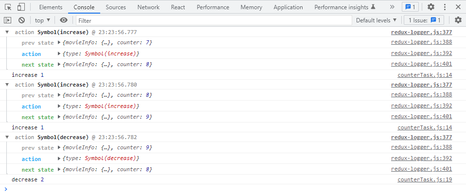
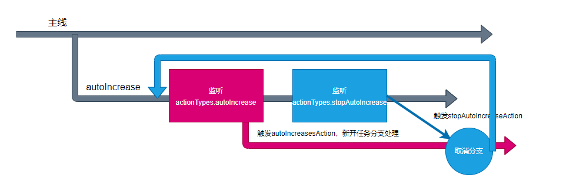

# redux-saga

**习惯过了头：**

> 中文文档地址：https://redux-saga-in-chinese.js.org/

- 纯净
- 强大
- 灵活


**应用redux-saga中间件**

```js
import { legacy_createStore as createStore, applyMiddleware } from 'redux';
import reducer from './reducer';
import logger from 'redux-logger';
import createSagaMiddleware from 'redux-saga';
import sagaTask from './saga';

const sagaMiddleware = createSagaMiddleware(); // create the saga middleware
const store = createStore(reducer, applyMiddleware(sagaMiddleware, logger));

// then run the saga 在最开始的时候，启动一个 saga任务（生成器创建函数）
sagaMiddleware.run(sagaTask);

export default store;
```


在saga任务中，如果yield了一个普通数据，saga不作任何处理，仅仅将数据作为yield表达式的返回值（将该数据作为下一次next的参数），因此，在saga中，yield一个普通数据没什么意义。

```js
export default function* () {
  const result = yield 1;
  console.log('hello saga!', result); //hello saga! 1
}
```


## saga 指令

saga需要你在yield后面放上一些合适的saga指令（saga effects），如果放的是指令，saga中间件会根据不同的指令进行特殊处理，以控制整个任务的流程。

每个指令本质上就是一个**函数**，该函数调用后，会返回一个指令对象，saga会接收到该指令对象，进行各种处理

**一旦saga任务完成（生成器函数运行完成），则saga中间件一定结束**

**大多数情况下，我们都希望saga持续发挥作用，因此，不能让saga任务完成**

**注意：监听指令函数的参数是action的类型，而不是action创建函数**

### take

take指令：【阻塞】监听某个action，如果action发生了，则会进行下一步处理，take指令仅监听一次。yield得到的是完整的action对象

```js
import { actionTypes } from '../action/counter';
import { take } from 'redux-saga/effects';

export default function* () {
  while (true) { //使用死循环配合yield特性，使take函数能够持续监听action，并且saga任务不会停止
    const result = yield take(actionTypes.increase);
    console.log('hello saga!', result);
  }
}
```

### all

all指令：【阻塞】该函数传入一个数组，数组中放入生成器，saga会等待所有的生成器全部完成后才会进一步处理

```js
import counterTask from './counterTask';
import movieInfoTask from './movieInfoTask';
import { all } from 'redux-saga/effects';

export default function* () {
  yield all([counterTask(), movieInfoTask()]); //all指令（函数）传递的数组中的每一项是生成器，而不是生成器函数
  console.log('saga end');
}
```

### ==takeEvery==

takeEvery指令：不断的监听某个action，当某个action到达之后，运行一个函数（参数1：action的类型或者 ‘*’（通配符，表示监听所有action，但是要求action的类型必须是一个字符串），参数2：generator creator(生成器创建函数)）。takeEvery永远不会结束当前的生成器。

**本质:**

fork了一个新的分支任务，在新的分支任务上，利用死循环+take监听action触发，触发action后，第二个参数配置的生成器函数，会再fork一个分支任务
```js
//大概代码
function takeEvery(actionType,generatorCreator){
  return fork(function* (){
    whlie(true){
    yield take(actionType)
    fork(generatorCreator)  
  }
  })
}
```

**counterTask.js**

```js
import { actionTypes } from '../action/counter';
import { takeEvery } from 'redux-saga/effects';

function* increase(action) { //takeEvery 会把当前的 action 追加到参数列表中。（即 action 将是 saga 的最后一个参数）
  const result = yield 1;
  console.log('increase', result); // increase 1
}

function* decrease() {
  const result = yield 2;
  console.log('decrease', result); //decrease 2
}

export default function* () {
  yield takeEvery(actionTypes.increase, increase);
  yield takeEvery(actionTypes.decrease, decrease);
}
```

**test.js**

```js
import store from './index';
import { createIncreaseAction, createDecreaseAction } from './action/counter';

store.dispatch(createIncreaseAction());
store.dispatch(createIncreaseAction());
store.dispatch(createDecreaseAction());
```

**控制台输出：**



### delay

delay指令：【阻塞】阻塞指定的毫秒数  

yield delay()表达式默认返回值为 true （即默认传递到下一次next方法中的参数为true）

参数1：3000（配置毫秒数）

参数2：可以配置yield delay()表达式的返回值（即传递到下一次next方法中的参数）

```js
import { actionTypes } from '../action/counter';
import { takeEvery, delay } from 'redux-saga/effects';

function* increase() {
  const result = yield delay(3000);
  console.log('increase', result); // increase true
  const result2 = yield delay(3000, 'abc');
  console.log('increase', result2); // increase abc
}

export default function* () {
  yield takeEvery(actionTypes.asyncIncrease, increase);
}
```

### ==put==

put指令：用于重新触发action，相当于dispatch一个action

```js
import { actionTypes, createIncreaseAction } from '../action/counter';
import { takeEvery, delay, put } from 'redux-saga/effects';

function* increase() {
  yield delay(3000); //3秒后，触发action
  yield put(createIncreaseAction());
}

export default function* () {
  yield takeEvery(actionTypes.asyncIncrease, increase);
}
```

### ==call==

call指令：【可能阻塞（取决于配置的函数是否返回promise）】用于副作用（通常是异步）函数调用

```js
import { getMoviesByPage } from '../../api/movie';
import { takeEvery, put, call } from 'redux-saga/effects';
import {
  actionTypes,
  createSetIsLoadingAction,
  createSetMovieInfoAction,
} from '../action/movieInfo/searchResult';

function* fetchMovieInfo() {
  yield put(createSetIsLoadingAction(true));
  
  
  //此处推荐利用call指令，规范yield返回的统一为指令对象，便于测试
  //也可写为： const movieInfo = yield getMoviesByPage(); 类似于await的使用方式
  //原理是：yield后面如果是Promise，saga中间件会等待该promise完成，并将该promise完成的结果作为yield表达式的值（作为下一次调用next方法的参数）；若该promise返回的是reject，则saga会使用generator.throw()方法抛出错误（抛出的错误为reject的结果 可用try catch捕获）
  const movieInfo = yield call(getMoviesByPage); 
  
  
  yield put(
    createSetMovieInfoAction(movieInfo.movieList, movieInfo.movieTotal)
  );
  yield put(createSetIsLoadingAction(false));
}

export default function* () {
  yield takeEvery(actionTypes.fetchMovieInfo, fetchMovieInfo);
}
```

**call的配置**

```js
//配置参数的方式，参数会传递到getMoviesByPage函数
const movieInfo = yield call(getMoviesByPage,param1,param2); 

//需要配置this指向，则第一个参数配置为一个数组，数组的第一项为this指向 函数内部this指向‘abc’
const movieInfo = yield call(['abc',getMoviesByPage],param1,param2);

//等价配置
const movieInfo = yield call({context: 'abc',fn: getMoviesByPage});
const movieInfo = yield call(['abc',getMoviesByPage]);
```

### apply

apply指令：【可能阻塞】用于副作用（通常是异步）函数调用

```js
//参数1：this指向 参数2：需要执行的函数 参数3：参数数组
const movieInfo = yield apply('abc',getMoviesByPage,[param1,param2]);
```

### ==select==

select指令：用于得到当前仓库中的数据

```js
import { getMoviesByPage } from '../../api/movie';
import { takeEvery, put, call, select } from 'redux-saga/effects';
import {
  actionTypes,
  createSetIsLoadingAction,
  createSetMovieInfoAction,
} from '../action/movieInfo/searchResult';

import { createSearchConditionChangeAction } from '../action/movieInfo/searchCondition';

function* fetchMovieInfo() {
  yield put(createSearchConditionChangeAction({ page: 24, limit: 10 }));
  yield put(createSetIsLoadingAction(true));
  const condition = yield select(state => state.movieInfo.condition); //获取仓库中的当前数据
  const movieInfo = yield call(getMoviesByPage,condition.page,condition.limit);
  yield put(
    createSetMovieInfoAction(movieInfo.movieList, movieInfo.movieTotal)
  );
  yield put(createSetIsLoadingAction(false));
}

export default function* () {
  yield takeEvery(actionTypes.fetchMovieInfo, fetchMovieInfo);
}
```

**细节**

```js
//等价condition
//1.
const condition = yield select(state => state.movieInfo.condition); //参数可传递一个函数，相当于对仓库的数据进行筛选

//2.
const state = yield select();
const condition = state.movieInfo.condition
```

### cps

cps指令：【可能阻塞】用于调用那些传统的回调方式的异步函数

```js
import { takeEvery, put, cps, select } from 'redux-saga/effects';
import {
  actionTypes,
  createSetIsLoadingAction,
  createSetMovieInfoAction,
} from '../action/movieInfo/searchResult';
import { createSearchConditionChangeAction } from '../action/movieInfo/searchCondition';

//模拟一个回调模式函数
function mockMovieInfo(page,limit,callback) {
  console.log(page,limit);
  setTimeout(() => {
    if (Math.random() > 0.5) {
      callback(null, {
        movieTotal: 24,
        movieList: [{ title: '前任3' }, { title: '战狼2' }],
      });
    } else {
      callback(new Error('出错'), null);
    }
  }, 3000);
}

function* fetchMovieInfo() {
  yield put(createSearchConditionChangeAction({ page: 24, limit: 10 }));
  yield put(createSetIsLoadingAction(true));
  const condition = yield select((state) => state.movieInfo.condition);
  const movieInfo = yield cps( //cps会自动把callback作为最后一个参数传递进来
    mockMovieInfo,
    condition.page,
    condition.limit
  );
  yield put(
    createSetMovieInfoAction(movieInfo.movieList, movieInfo.movieTotal)
  );
  yield put(createSetIsLoadingAction(false));
}

export default function* () {
  yield takeEvery(actionTypes.fetchMovieInfo, fetchMovieInfo);
}
```

### fork

fork：用于开启一个新的任务，该任务不会阻塞，该函数需要传递一个生成器函数，fork返回了一个对象，类型为Task

### `fork(fn, ...args)`

**fork不会阻塞任务的运行，类似于新开了一个线程（或分支），fork任务中的阻塞只会阻塞该分支，而不会阻塞主分支**

```js
//由于fork不会阻塞任务的运行，因此先输出：'listening asyncIncrease'，3秒后再输出：'fork end'

import { actionTypes, createIncreaseAction } from '../action/counter';
import { takeEvery, delay, put, fork } from 'redux-saga/effects';

function* increase() {
  yield delay(3000);
  yield put(createIncreaseAction());
}

function* test() {
  yield delay(3000);
  console.log('fork end');
}

export default function* () {
  yield fork(test);
  yield takeEvery(actionTypes.asyncIncrease, increase);
  console.log('listening asyncIncrease');
}
```


### cancel

cancel：用于取消一个或多个任务，实际上，取消的实现原理，是利用generator.return。cancel可以不传递参数，如果不传递参数，则取消当前任务线。

```js
import {
  actionTypes,
  createIncreaseAction,
  createDecreaseAction,
} from '../action/counter';
import { takeEvery, delay, put, fork, take, cancel } from 'redux-saga/effects';

function* asyncIncrease() {
  let task = null;
  while (true) {
    yield take(actionTypes.asyncIncrease);
    if (task) {
      yield cancel(task); //取消上一次的任务,可依次传递多个任务取消
    }
    task = yield fork(function* () {
      yield delay(3000);
      yield put(createIncreaseAction());
    });
  }
}

function* asyncDecrease() {
  yield delay(3000);
  yield put(createDecreaseAction());
}

export default function* () {
  yield fork(asyncIncrease);
  yield takeEvery(actionTypes.asyncDecrease, asyncDecrease);
  console.log('listening asyncDecrease');
}
```

### takeLastest

takeLastest：功能和takeEvery一致，只不过，会自动取消掉之前开启的任务

`takeLatest(actionTypes.autoIncrease, autoIncrease)`：

- 监听action触发，并且每次触发后会取消上一次的autoIncrease（分支任务）

*等价代码：*

```js
//1.
function* autoIncrease() {
  while (true) {
    yield delay(1000);
    yield put(createIncreaseAction());
  }
}

export default function* () {
  yield takeLatest(actionTypes.autoIncrease, autoIncrease);
  console.log('listening autoIncrease');
}

//2.
function* autoIncrease() {
  let task = null;
  while (true) {
    yield take(actionTypes.autoIncrease);
    if (task) {
      yield cancel(task);
    }
    task = yield fork(function* () {
      while (true) {
        yield delay(1000);
        yield put(createIncreaseAction());
      }
    });
  }
}

export default function* () {
  yield fork(autoIncrease);
  console.log('listening autoIncrease');
}
```

### cancelled

cancelled：判断当前任务线是否被取消掉了

```js
import { actionTypes, createIncreaseAction } from '../action/counter';
import { delay, put, fork, take, cancel,cancelled } from 'redux-saga/effects';

function* autoIncrease() {
  while (true) {
    yield take(actionTypes.autoIncrease); 
    let task = yield fork(function* () {
      while (true) {
       try{
        yield delay(1000);
        yield put(createIncreaseAction());
       }
       finally{ //由于finally无论如何都会运行，所以考虑在此处判断当前任务线是否被取消掉了
        if(yield cancelled()){
          console.log('cancel autoIncrease');
        }
       }
      }
    });
    yield take(actionTypes.stopAutoIncrease); 
    yield cancel(task);
  }
}

export default function* () {
  yield fork(autoIncrease);
  console.log('listening autoIncrease');
}
```

### race

race：【阻塞】竞赛，可以传递多个指令，当其中任何一个指令结束后，会直接结束，与Promise.race类似。返回的结果，是最先完成的指令结果。并且，该函数会自动取消其他的任务

```js
import {delay,race, call,} from 'redux-saga/effects';

function* test() {
  const n = Math.random() * 4000 + 1000;
  yield delay(n);
  return n;
}

export default function* () {
  const result = yield race({
    task1: call(test),
    task2: call(test),
  });
  console.log(result); //{task1:...} 或者 {task2:...}
}
```

**race实现自动增加数字和停止**

```js
import { actionTypes, createIncreaseAction } from '../action/counter';
import { delay, put, fork, take, race, call } from 'redux-saga/effects';

function* autoIncrease() {
  while (true) {
    yield take(actionTypes.autoIncrease);
    yield race({
      autoIncrease: call(function* () {
        while (true) {
          yield delay(1000);
          yield put(createIncreaseAction());
        }
      }),
      cancel: take(actionTypes.stopAutoIncrease),
    });
  }
}

export default function* () {
  yield fork(autoIncrease);
  console.log('listening autoIncrease');
}
```

### 流程控制模式

**细节：对于有关联的任务，我们考虑使用流程控制模式为最优解**

核心在于，不同任务的执行是互斥的，并且是相互影响的

```js
import { actionTypes, createIncreaseAction } from '../action/counter';
import { delay, put, fork, take, cancel } from 'redux-saga/effects';

/**
 * 流程控制
 * 开始-->停止-->开始-->停止
 */
function* autoIncrease() {
  while (true) {
    yield take(actionTypes.autoIncrease); // 第一步，监听自动增加action
    let task = yield fork(function* () {
      //第二步,触发自动增加action，新开任务分支处理
      while (true) {
        yield delay(1000);
        yield put(createIncreaseAction());
      }
    });
    yield take(actionTypes.stopAutoIncrease); //第三步,新开任务分支处理的同时，监听停止action
    yield cancel(task);
  }
}

export default function* () {
  yield fork(autoIncrease);
  console.log('listening autoIncrease');
}
```

*原理图：*



