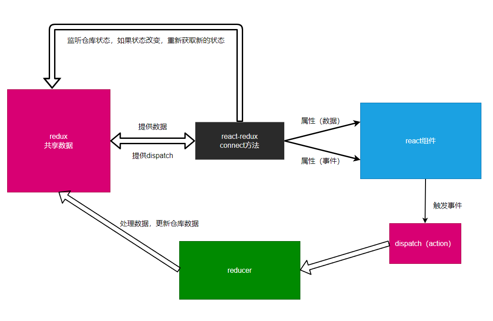

# react-redux

[npm](https://www.npmjs.com/package/react-redux) [官网](https://react-redux.js.org/)

- React: 组件化的UI界面处理方案
- React-Router: 根据地址匹配路由，最终渲染不同的组件
- Redux：处理数据以及数据变化的方案（主要用于处理共享数据）

> 如果一个组件，仅用于渲染一个UI界面，而没有状态（通常是一个函数组件），该组件叫做**展示组件**
> 如果一个组件，仅用于提供数据，没有任何属于自己的UI界面，则该组件叫做**容器组件**，容器组件纯粹是为了给其他组件提供数据。



## react-redux 使用


react-redux库：链接redux和react

- Provider组件：没有任何UI界面，该组件的作用，是将redux的仓库放到一个上下文中。
- connect：高阶组件，用于链接仓库和组件的
  - 细节一：如果对返回的容器组件加上额外的属性，则这些属性会直接传递到展示组件
  - 第一个参数：mapStateToProps: 
    - 参数1：整个仓库的状态
    - 参数2：使用者传递的属性对象
  - 第二个参数：
    - 情况1：传递一个函数 mapDispatchToProps
      - 参数1：dispatch函数
      - 参数2：使用者传递的属性对象
      - 函数返回的对象会作为属性传递到展示组件中（作为事件处理函数存在）
    - 情况2：传递一个对象，对象的每个属性是一个action创建函数，当事件触发时，会自动的dispatch函数返回的action
  - 细节二：如果不传递第二个参数，通过connect连接的组件，会自动得到一个属性：dispatch，使得组件有能力自行触发action，但是，不推荐这样做。

## 案例

以下为等效代码

### 手写实现 connect

**app.js**

```js
import React from 'react';
import Counter from './components/Counter';

export default function App() {
  return (
    <div>
      <Counter />
    </div>
  );
}
```

**Counter.js**

```js
import React from 'react';
import store from '../store';
import {
  increase,
  decrease,
  asyncIncrease,
  asyncDecrease,
} from '../store/action/counter';

//展示组件
function Counter(props) {
  return (
    <div>
      <h1>{props.number}</h1>
      <button onClick={props.onIncrease}>+</button>
      <button onClick={props.onDecrease}>-</button>
      <button onClick={props.onAsyncDecrease}>异步-</button>
      <button onClick={props.onAsyncIncrease}>异步+</button>
    </div>
  );
}

//仓库数据与展示组件属性之间映射
function mapStateToProps(state) {
  return {
    number: state.counter,
  };
}

//dispatch分发action与属性之间的映射
function mapDispatchToProps(dispatch) {
  return {
    onDecrease() {
      dispatch(decrease());
    },
    onIncrease() {
      dispatch(increase());
    },
    onAsyncIncrease() {
      dispatch(asyncIncrease());
    },
    onAsyncDecrease() {
      dispatch(asyncDecrease());
    },
  };
}

//数据容器组件
export default class CounterContainer extends React.PureComponent {
  constructor(props) {
    super(props);
    this.state = mapStateToProps(store.getState());
    store.subscribe(() => {
      this.setState(mapStateToProps(store.getState()));
    });
  }

  render() {
    const events = mapDispatchToProps(store.dispatch);
    return <Counter {...this.state} {...events} />;
  }
}

```

### react-redux connect、Provider方法使用

**app.js**

```js
import React from 'react';
import { Provider } from 'react-redux';
import store from './store'
import Counter from './components/Counter';

export default function App() {
  return (
    <Provider store={store}>
      <Counter />
    </Provider>
  );
}
```

**Counter.js**

```js
import React from 'react';
import { connect } from 'react-redux';
import {
  increase,
  decrease,
  asyncIncrease,
  asyncDecrease,
} from '../store/action/counter';

//展示组件
function Counter(props) {
  return (
    <div>
      <h1>{props.number}</h1>
      <button onClick={props.onIncrease}>+</button>
      <button onClick={props.onDecrease}>-</button>
      <button onClick={props.onAsyncDecrease}>异步-</button>
      <button onClick={props.onAsyncIncrease}>异步+</button>
    </div>
  );
}

function mapStateToProps(state) {
  return {
    number: state.counter,
  };
}

function mapDispatchToProps(dispatch) {
  return {
    onDecrease() {
      dispatch(decrease());
    },
    onIncrease() {
      dispatch(increase());
    },
    onAsyncIncrease() {
      dispatch(asyncIncrease());
    },
    onAsyncDecrease() {
      dispatch(asyncDecrease());
    },
  };
}

//数据容器组件
export default connect(mapStateToProps, mapDispatchToProps)(Counter);

```

