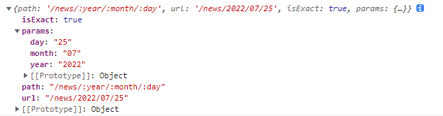

# 路由信息

Router组件内部会创建一个上下文，并且向上下文中注入一些信息

该上下文对开发者是隐藏的，Route组件若匹配到了地址，则会将这些上下文中的信息**作为属性**传入地址所匹配的组件（即Route组件的`component`属性对应的组件）

## history

它并不是window.history对象，我们利用该对象实现无刷新跳转

**为什么没有直接使用history对象**

1. React-Router中有两种模式：Hash、History，如果直接使用window.history，仅能支持一种模式
2. 当使用window.history.pushState方法时，没有办法收到任何通知，将导致React无法知晓地址发生了变化，结果导致无法重新渲染组件

- push：将某个新的地址入栈（历史记录栈）
  - 参数1：新的地址
  - 参数2：可选，附带的状态数据（可在目标页通过location.state进行获取）
- replace：将某个新的地址替换掉当前栈中的地址
- go: 与window.go一致
- goForward: 与window.forward一致
- goBack: 与window.back一致

## location

与history.location完全一致，是同一个对象，但是，与window.location不同

location对象中记录了当前地址的相关信息

我们通常使用第三方库```query-string```，用于解析地址栏中的数据

pathname、serach、hash、state

```js
import qs from 'query-string';
console.log(qs.parse(props.location.search));
console.log(qs.parse(props.location.hash));
```

## match

该对象中保存了，路由匹配的相关信息

- isExact：事实上，当前地址栏的路径和路由配置的路径是否是精确匹配的，与是否在`Route`组件配置`exact`属性无关
- params：获取路径规则中对应的数据
- path：当前所匹配到的组件对应的`Route`组件的path属性值
- url：地址栏参数中满足匹配规则的那一部分地址栏参数

实际上，在书写Route组件的path属性时，可以书写一个```string pattern```（字符串正则）

如果路径字符串正则配置如下：

```js
 <Route path="/news/:year/:month/:day" component={News}></Route>
```

且地址栏参数为：http://localhost:3000/news/2022/07/25 

打印`match`如下图所示：



**细节**

```js
<Route path="/news-:year-:month-:day" component={News}></Route> //间隔符自行配置
<Route path="/news/:year/:month?/:day?" component={News}></Route> //可通过类似正则的匹配方式，配置？,则表示该处可有可无
<Route path="/news/:year(\d+)/:month?/:day?" component={News}></Route> //可通过（）配置该处匹配的正则，/:year(\d+) 匹配一个或多个数字
<Route path={['/news',"/news/:year(\d+)/:month?/:day?",'/abc']} component={News}></Route> //path配置成一个数组，则任意满足其一即可匹配
```

react-router使用了第三方库：Path-to-RegExp，该库的作用是，将一个字符串正则转换成一个真正的正则表达式。

**向某个页面传递数据的方式：**

1. 使用state：在push页面时，加入state
2. **利用search：把数据填写到地址栏中的？后**
3. 利用hash：把数据填写到hash后
4. **params：把数据填写到路径中**

## 非路由组件获取路由信息

某些组件，并没有直接放到Route中，而是嵌套在其他普通组件中，因此，它的props中没有路由信息，如果这些组件需要获取到路由信息，可以使用下面两种方式：

1. 将路由信息从父组件一层一层传递到子组件
2. 使用react-router提供的高阶组件withRouter，包装要使用的组件，该高阶组件会返回一个新组件，新组件将向提供的组件注入路由信息。