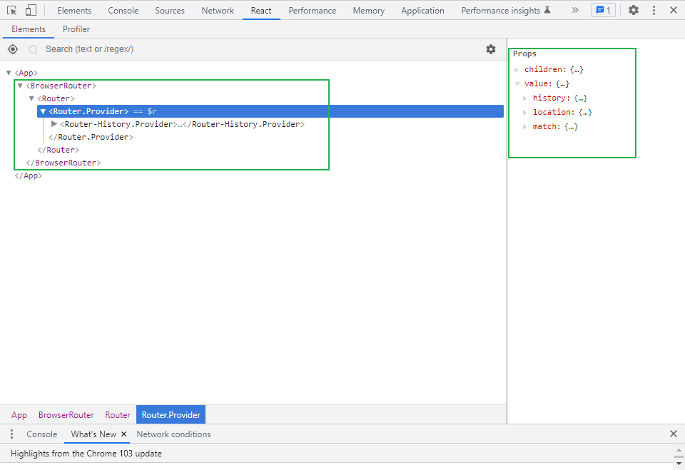
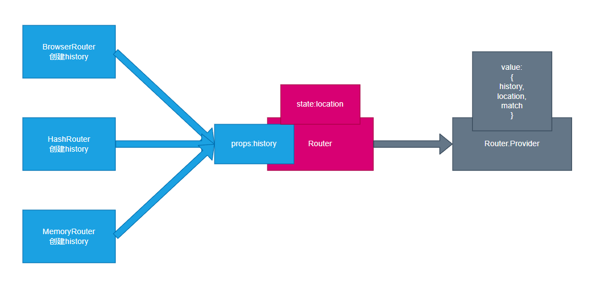

# 实现Router






## 实现 Router组件

### 创建一个上下文对象

创建一个上下文对象，供Router组件使用

```js
//RouterContext.js

import { createContext } from 'react';
const ctx = createContext();
ctx.displayName = "Router";//在调试工具中显示的名字
export default ctx;
```

### Router组件

**Router组件利用BrowserRouter组件传递的属性（history对象），创建一个状态location，内部提供一个上下文对象{history,location,match}**

```js
import React, { Component } from 'react';
import PropTypes from 'prop-types';
import ctx from './RouterContext';
import matchPath from './matchPath';

export default class Router extends Component {
  //属性约束
  static propTypes = {
    history: PropTypes.object.isRequired,
    children: PropTypes.node,
  };

  //创建一个状态location 目的是改变页面后能够重新更新组件 
  state = {
    location: this.props.history.location,
  };

  //挂载完成，添加监听器，监听页面的改变，页面改变后重新设置状态，从而组件更新
  componentDidMount() {
    this.unListen = this.props.history.listen((location, action) => {
      this.props.history.action = action;
      this.setState({ location });
    });
  }

  componentWillUnmount() {
    this.unListen(); //取消监听
  }

  render() {
    //组装上下文数据
    const ctxValue = { 
      history: this.props.history,
      location: this.state.location,
      match: matchPath('/', this.state.location.pathname),
    };

    return <ctx.Provider value={ctxValue}>{this.props.children}</ctx.Provider>;
  }
}
```

## 实现 BrowserRouter组件

**BrowserRouter组件仅创建一个history对象，并将history对象作为属性传递给Router组件**

**BrowserRouter组件将属性作为参数配置对象，用于创建一个history对象**

```js
//BrowserRouter.js

import React, { Component } from 'react';
import { Router } from '../react-router';
import { createBrowserHistory } from './history';
import PropTypes from 'prop-types';

export default class BrowserRouter extends Component {
  //属性约束
  static propTypes = {
    basename: PropTypes.string,
    forceRefresh: PropTypes.bool,
    keyLength: PropTypes.number,
    getUserConfirmation: PropTypes.func,
  };

  history = createBrowserHistory(this.props); //BrowserRouter组件将属性作为参数配置对象，用于创建一个history对象

  render() {
   return <Router history={this.history}> //BrowserRouter组件仅创建一个history对象，并将history对象作为属性传递给Router组件
            {this.props.children} //BrowserRouter组件将自己的children传递给Router组件也作为children
          </Router>;
  }
}
```

