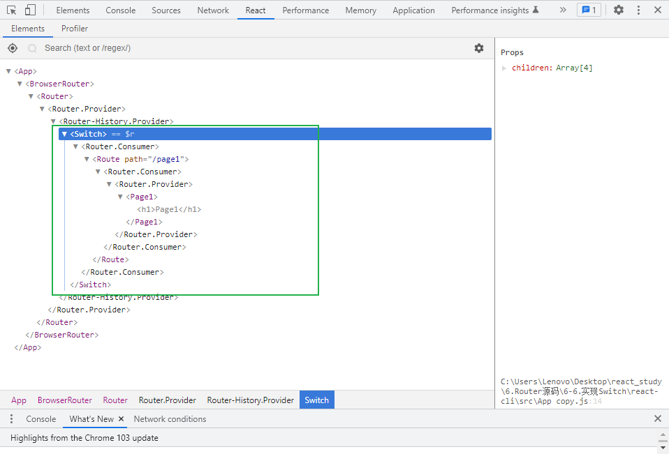

# 实现 Switch

Switch：匹配Route子元素，渲染第一个匹配到的Route



## 核心思想

**实现Switch：循环Switch组件的children，依次匹配每一个Route组件，当匹配到时，直接渲染，停止循环**

## 封装 Switch组件

```js
import React, { Component } from 'react';
import matchPath from './matchPath';
import ctx from './RouterContext';
import Route from './Route';

export default class Switch extends Component {
  /**
   * 循环children，得到第一个匹配的Route组件，若没有匹配，则返回null
   */
  handleRenderChildren = (ctx) => {
    //Switch中
    //不传元素 值为undefined
    //只传递一个Route 值为一个react元素
    //传递多个Route 值为一个react元素数组
    //无论传递内容是哪一种情况，内部都固定为一个children数组
    let children = [];
    if (Array.isArray(this.props.children)) {
      children = this.props.children;
    } else {
      if (typeof this.props.children === 'object') {
        children = [this.props.children];
      }
    }
    for (const child of children) {
      if (child.type !== Route) {
        throw new TypeError(
          'the children of Switch component must be type of Route'
        );
      }
      const {
        path = '/',
        exact = false,
        strict = false,
        sensitive = false,
      } = child.props;
      const match = matchPath(path, ctx.location.pathname, {
        exact,
        strict,
        sensitive,
      });
      if (match) {
        //该Route组件匹配了
        return child;
      }
    }
    return null;
  };

  render() {
    return <ctx.Consumer>{this.handleRenderChildren}</ctx.Consumer>;
  }
}
```

