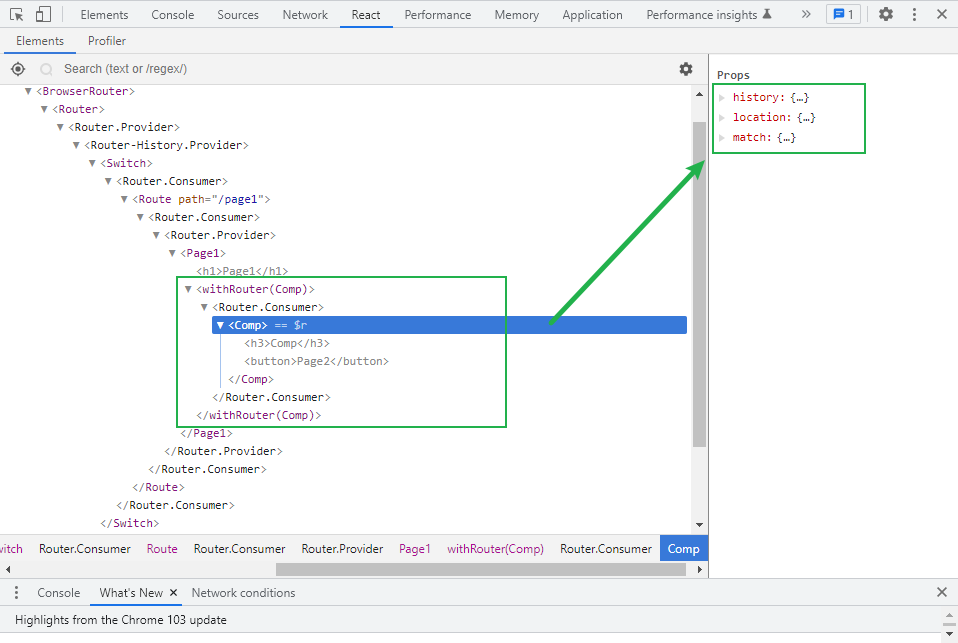

# withRouter



## 核心思想

**HOC高阶组件，用于将路由上下文中的数据，作为属性注入到组件中**

## 封装withRouter组件

```js
import React from 'react';
import ctx from './RouterContext';

export default function withRouter(Comp) {
  function RouterWrapper(props) {
    return <ctx.Consumer>{(value) => <Comp {...value} {...props} />}</ctx.Consumer>; //注入上下文数据，并传递自身接收的s
  }
  //设置组件在调试工具中显示的名字
  RouterWrapper.displayName = `withRouter(${Comp.displayName || Comp.name})`;
  return RouterWrapper;
}
```

