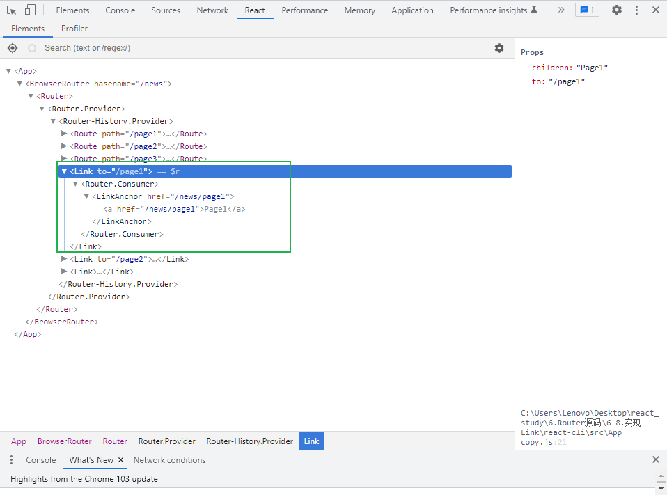
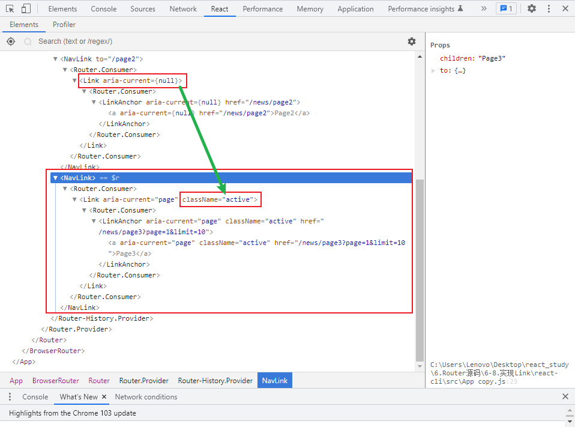

# 实现 Link

## 实现 Link组件

### 原理图



### 封装 Link组件

**核心思想**

封装一个a便签，并利用history对象里面的push、repalce方法实现无刷新跳转页面

```js
import React from 'react';
import ctx from '../react-router/RouterContext';
//parsePathInfo 根据字符串路径返回一个location对象，参数传递方式:{path：字符串路径}
import { parsePathInfo } from './history/createBrowserHistory';

export default function Link(props) {
  //解构出to属性，replace属性，其余属性收集起来

  //to属性：无论to属性传递的是字符串还是对象，最终需要构造一个字符串href供a标签使用
  //replace属性：布尔属性，根据replace属性值决定使用history.push还是history.replace跳转页面
  //...rest :收集其他属性，直接传递给a标签（例如：style属性，这样在Link上书写的样式都会传递到a标签上）
  const { to, replace, ...rest } = props;

  return (
    <ctx.Consumer>
      {({ history }) => {
        let href, location; //location：构造一个location对象，供跳转页面时传参使用
        if (typeof props.to === 'object') {
          location = props.to;
        } else {
          location = parsePathInfo({ path: props.to });
        }
        href = history.createHref(location);
        return (
          <a
            {...rest}
            href={href}
            onClick={(e) => {
              e.preventDefault();
              if (replace) {
                history.replace(location);
              } else {
                history.push(location);
              }
            }}
          >
            {props.children}
          </a>
        );
      }}
    </ctx.Consumer>
  );
}
```

## 实现 NavLink组件

### 原理图



### 封装 NavLink组件

**核心思想**

NavLink组件内部，匹配路由。匹配成功则传递类样式至Link组件，即图中所示匹配成功的Link组件带有className属性，未匹配成功的Link组件则不带有该属性。

```js
import React from 'react';
import Link from './Link';
import matchPath from '../react-router/matchPath';
import ctx from '../react-router/RouterContext';

export default function NavLink(props) {
  const {
    activeClassName = 'active',
    exact = false,
    strict = false,
    ...rest
  } = props;

  return (
    <ctx.Consumer>
      {({ location }) => {
        let path;
        if (typeof props.to === 'object') {
          path = props.to.pathname;
        } else {
          path = props.to;
        }
        //无论to属性传递的是字符串还是对象，最终需要构造一个字符串正则path供匹配函数matchPath使用
        const match = matchPath(path, location.pathname, { exact, strict });
        if (match) {
          return <Link {...rest} className={activeClassName}></Link>;
        } else {
          return <Link {...rest}></Link>;
        }
      }}
    </ctx.Consumer>
  );
}
```

