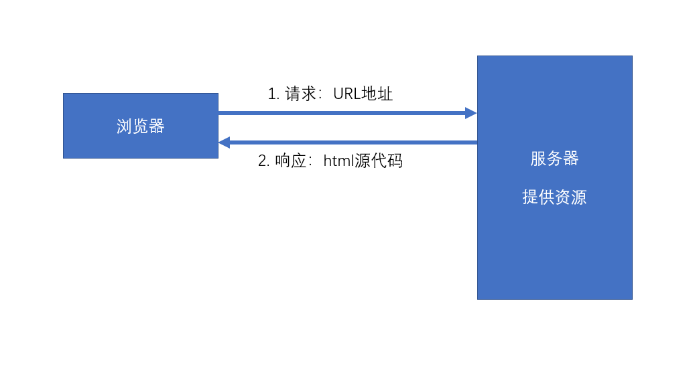

# Redux核心概念

action  reducer  store

## MVC

它是一个UI的解决方案，用于降低UI，以及UI关联的数据的复杂度。

**传统的服务器端的MVC**



环境：

1. 服务端需要响应一个完整的HTML
2. 该HTML中包含页面需要的数据
3. 浏览器仅承担渲染页面的作用

以上的这种方式叫做**服务端渲染**，即服务器端将完整的页面组装好之后，一起发送给客户端。

服务器端需要处理UI中要用到的数据，并且要将数据嵌入到页面中，最终生成一个完整的HTML页面响应。

为了降低处理这个过程的复杂度，出现了MVC模式。


**Controller**: 处理请求，组装这次请求需要的数据
**Model**：需要用于UI渲染的数据模型
**View**：视图，用于将模型组装到界面中


**前端MVC模式的困难**

React解决了   数据 -> 视图   的问题

1. 前端的controller要比服务器复杂很多，因为前端中的controller处理的是用户的操作，而用户的操作场景是复杂的。
2. 对于那些组件化的框架（比如vue、react），它们使用的是单向数据流。若需要共享数据，则必须将数据提升到顶层组件，然后数据再一层一层传递，极其繁琐。 虽然可以使用上下文来提供共享数据，但对数据的操作难以监控，容易导致调试错误的困难，以及数据还原的困难。并且，若开发一个大中型项目，共享的数据很多，会导致上下文中的数据变得非常复杂。

比如，上下文中有如下格式的数据：

```js
value = {
    users:[{},{},{}],
    addUser: function(u){},
    deleteUser: function(u){},
    updateUser: function(u){}
}
```


## 前端需要一个独立的数据解决方案

**Flux**

Facebook提出的数据解决方案，它的最大历史意义，在于它引入了action的概念

action是一个普通的对象，用于描述要干什么。**action是触发数据变化的唯一原因**

store表示数据仓库，用于存储共享数据。还可以根据不同的action更改仓库中的数据

示例：

```js
var loginAction = {
    type: "login",
    payload: {
        loginId:"admin",
        loginPwd:"123123"
    }
}

var deleteAction = {
    type: "delete",
    payload: 1  // 用户id为1
}
```

**Redux**

在Flux基础上，引入了reducer的概念

reducer：处理器，用于根据action来处理数据，处理后的数据会被仓库重新保存。


## Redux理解

**习惯过了头：**

> 谈到对Redux的理解的话，可能要追溯到前端还没有兴起的年代。
>
> 最初，采用的方式是**服务端渲染**，也就是说在服务器端将完整的页面以及页面需要的数据组装好之后形成一个完整的HTML，再将这个HTML发送给浏览器，浏览器仅承担渲染页面的作用。然而，在服务端渲染这种模式下，导致了服务器端的复杂度大大增加，于是出现了MVC模式。它是一个UI的解决方案，用于降低UI以及UI关联的数据的复杂度。MVC：**Controller**: 处理请求，拿到这次请求需要的数据 **Model**：需要用于UI渲染的数据模型 **View**：视图，用于将数据模型组装到页面中。
>
> 后来，伴随着Vue、React等前端框架的诞生与兴起，后端工程师终于不堪重负，出现了前后端分离。在前后端分离这种模式下，服务器仅响应一个最基础的HTML页面和一些JS文件，页面上几乎所有元素均是通过执行JS文件在浏览器端进行创建。
>
> 由此，前端开发者需要做的事情也越来越多，于是呢前端开发者想要一套类似于服务器端MVC模式的解决方案来降低复杂度。
>
> 然而，诸如Vue、React等前端框架仅仅解决了数据关联到页面的问题。我们发现前端试图实现的类似于controller的模块要比服务器复杂很多，因为前端中的controller处理的是用户的操作，而用户的操作场景是非常复杂的。并且我们发现对于那些组件化的框架（比如vue、react），它们使用的是单向数据流。若需要共享数据，则必须将数据提升到顶层组件，然后数据再一层一层传递，极其繁琐。 虽然可以使用上下文来提供共享数据，但对数据的操作难以监控，容易导致调试错误的困难，以及数据还原的困难。并且，若开发一个大中型项目，共享的数据很多，会导致上下文中的数据变得非常复杂。
>
> 诸如上述，前端需要一个独立的数据解决方案
>
> 这个时候呢，Facebook提出了一种数据解决方案叫做Flux。它的最大历史意义，在于它引入了action的概念。action是一个普通的对象，用于描述要干什么。比如，我们想要提交一个登录请求，无论用户是点击按钮导致的登录，或者是按下键盘导致的登录、又或者系统自动登录，无论是哪一种用户操作，它们想要实现的无非就是登录，这个时候我们只需要dispatch分发一个用于登录的action即可，我们无需再关心用户具体是怎么触发的登录，这样我们降低了复杂度**action是触发数据变化的唯一原因**；store表示数据仓库，用于存储共享数据。还可以根据不同的action更改仓库中的数据
>
> **Redux**，在Flux基础上，引入了reducer的概念。reducer：处理器，用于根据action来处理数据，处理后的数据会被仓库重新保存。

