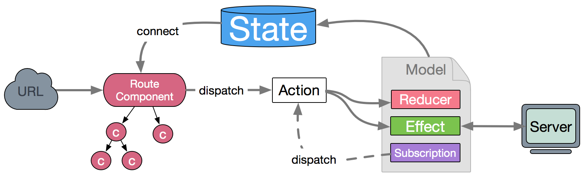

# dva

> 官方网站：https://dvajs.com
> dva不仅仅是一个第三方库，更是一个框架，它主要整合了redux的相关内容，让我们处理数据更加容易，实际上，dva依赖了很多：react、react-router、redux、redux-saga、react-redux、connected-react-router等。



# dva的使用

1. dva默认导出一个函数，通过调用该函数，可以得到一个dva对象
2. dva对象.router：路由方法，传入一个函数，该函数返回一个React节点，将来，应用程序启动后，会自动渲染该节点。
3. dva对象.start: 该方法用于启动dva应用程序，可以认为启动的就是react程序，该函数传入一个选择器，用于选中页面中的某个dom元素，react会将内容渲染到该元素内部。
4. dva对象.model: 该方法用于定义一个模型，该模型可以理解为redux的action、reducer、redux-saga副作用处理的整合，整合成一个对象，将该对象传入model方法即可。
   1. namespace：命名空间，该属性是一个字符串，字符串的值，会被作为仓库中的属性保存
   2. state：该模型的默认状态
   3. reducers: 该属性配置为一个对象，对象中的每个方法就是一个reducer，dva约定，方法的名字，就是匹配的action类型
   4. effects: 处理副作用，底层是使用redux-saga实现的，该属性配置为一个对象，对象中的每个方法均处理一个副作用，方法的名字，就是匹配的action类型。
      1. 函数的参数1：action
      2. 参数2：封装好的saga/effects对象
   5. subscriptions：配置为一个对象，该对象中可以写任意数量任意名称的属性，每个属性是一个函数，这些函数会在模型加入到仓库中后立即运行。由于这一特性，适合利用它订阅一些事件，因为它只会运行一次。
      1. 参数：一个对象{dispatch:…,history…} 包含dispath和history两个属性

**index.js**

工程入口模块：

```js
import React from 'react';
import App from './App';
import dva from 'dva';
import counter from './models/counter';

const app = dva(); //得到一个dva对象
app.model(counter); //在启动之前定义模型
app.router(() => <App />); //设置根路由，即启动后，要运行的函数，函数的返回结果会被渲染
app.start('#root');
```

**models/counter.js**

```js
export default {
  namespace: 'counter',
  state: 0,
  reducers: {
    increase(state) {
      return state + 1;
    },
    decrease(state) {
      return state - 1;
    },
    add(state, { payload }) {
      return state + payload;
    },
  },
  effects: {
    *asyncIncrease(action, { call, put }) {
      yield call(delay, 1000);
      yield put({ type: 'increase' });
    },
    *asyncDecrease(action, { call, put }) {
      yield call(delay, 1000);
      yield put({ type: 'decrease' });
    },
  },
  subscriptions: {
    //订阅窗口尺寸变化，每次变化让数字增加
    resizeIncrease({ dispatch, history }) {
      window.onresize = () => {
        dispatch({ type: 'increase' });
      };
    },
    historyChange({ dispatch, history }) {
      history.listen(() => {
        dispatch({ type: 'decrease' });
      });
    },
  },
};

function delay(duration) {
  return new Promise((resolve) => {
    setTimeout(() => {
      resolve();
    }, duration);
  });
}
```

**展示组件Counter.js**

```js
import React, { useRef } from 'react';
import { connect } from 'dva';

function Counter(props) {
  const inp = useRef();
  return (
    <div>
      <h3>{props.number}</h3>
      <button onClick={props.onIncrease}>+</button>
      <button onClick={props.onAsyncIncrease}>异步+</button>
      <button onClick={props.onAsyncDecrease}>异步-</button>
      <button onClick={props.onDecrease}>-</button>
      <input type="number" ref={inp} />
      <button
        onClick={() => {
          const val = parseInt(inp.current.value);
          props.onAdd(val);
        }}
      >
        +++
      </button>
    </div>
  );
}

const mapStateToProps = (state) => ({
  number: state.counter,
});

const mapDispatchToProps = (dispatch) => ({
  onIncrease() {
    dispatch({ type: 'counter/increase' }); //action类型前面需要跟上命名空间
  },
  onDecrease() {
    dispatch({ type: 'counter/decrease' });
  },
  onAdd(n) {
    dispatch({ type: 'counter/add', payload: n });
  },
  onAsyncIncrease() {
    dispatch({ type: 'counter/asyncIncrease' });
  },
  onAsyncDecrease(){
    dispatch({ type: 'counter/asyncDecrease' });
  }
});

export default connect(mapStateToProps, mapDispatchToProps)(Counter);
```

5. 在dva中同步路由到仓库
   1. 在调用dva函数时，配置history对象
   
      ```js
      const app = dva({
        history: createBrowserHistory(),
      }); 
      ```
   
   2. 使用ConnectedRouter提供路由上下文
   
      ```js
      import React from 'react';
      import { Link, Route, Switch, routerRedux } from 'dva/router'; //Connected-react-router的组件由routerRedux对象导出
      import Counter from './Counter';
      import Home from './Home';
      
      export default function routeConfig(props) {
        return (
          <routerRedux.ConnectedRouter history={props.history}> //dva配置的history对象会从props传递到 app.router配置的函数
            <div>
              <div>
                <Link to="/">Home</Link>
                <Link to="/counter">Counter</Link>
              </div>
              <div>
                <Switch>
                  <Route path="/counter" component={Counter} />
                  <Route path="/" component={Home} />
                </Switch>
              </div>
            </div>
          </routerRedux.ConnectedRouter>
        );
      }
      ```


6. 配置：
   1. history：同步到仓库的history对象
   
   2. initialState：创建redux仓库时，使用的默认状态，配置为一个对象，对象每个属性对应模型的namespace，属性值为默认状态（我们一般在模型中给不同的模型赋予了不同的初值即state，因此此配置一般无需使用）
   
   3. onError（err,dispatch）: 当仓库的运行发生错误的时候，运行的函数（全局处理一些错误）
   
   4. onAction: 可以配置redux中间件
      1. 传入一个中间件对象（直接配置一个中间件即可）
      2. 传入一个中间件数组（若需要配置多个中间件）
   
   5. onStateChange(state): 当仓库中的状态发生变化时运行的函数
   
   6. onReducer(reducer)：对模型中的reducer的进一步封装
   
   7. onEffect(oldEffect, sagaEffects, model, actionType)：类似于对模型中的effect的进一步封装
   
      1. oldEffect:
   
         ```js
         function* (action){ //oldEffect
           yield effect(action,saga/effects) //这里才是模型中的effect
         }
         ```
   
   8. extraReducers：用于配置额外的reducer，它是一个对象，对象的每一个属性是一个方法，每个方法就是一个需要合并的reducer，方法名即属性名。
   
      ```js
      extraReducers: {
          abc(state = 123, action) {
                return state;
          },
          bcd(state = 456, action) {
                return state;
          }
      },
      ```
   
   9. extraEnhancers: 它是用于封装createStore函数的，dva会将原来的仓库创建函数作为参数传递，返回一个新的用于创建仓库的函数。函数必须放置到数组中。数组中每一项为一个函数，该函数返回一个仓库创建函数
   
      ```js
      extraEnhancers: [function (createStore) {
              return function (...args) {
                  console.log("即将创建仓库1")
                  return createStore(...args);
              }
          }, function (createStore) {
              return function (...args) {
                  console.log("即将创建仓库2")
                  return createStore(...args);
              }
      }]
      ```
   
      