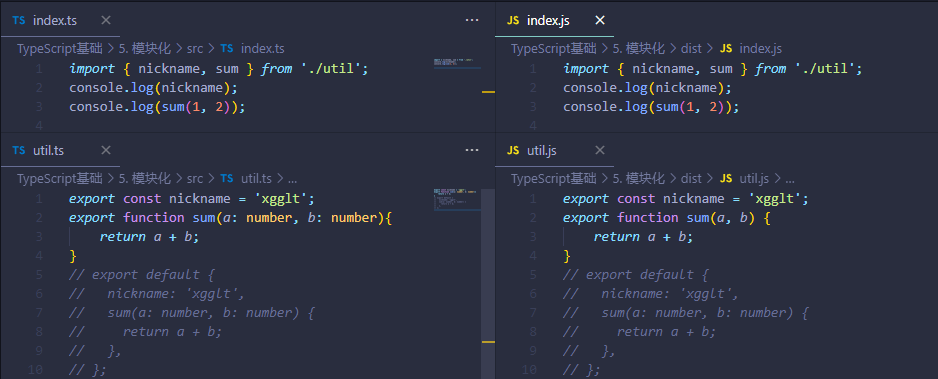
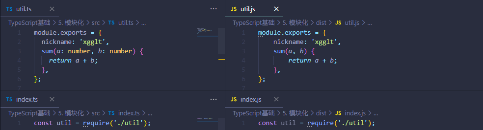
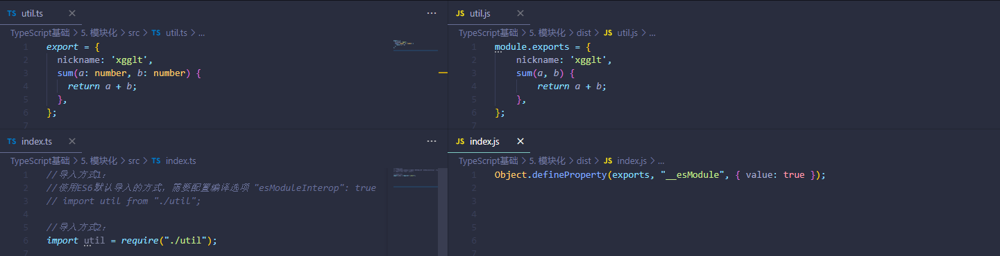

# 模块化

TS编译选项相关配置

| 配置名称            | 含义                           |
| ------------------- | ------------------------------ |
| module              | 配置编译结果中使用的模块化标准 |
| moduleResolution    | 设置解析模块的模式             |
| noImplicitUseStrict | 编译结果中不包含“use strict”   |
| removeComments      | 编译结果移除注释               |
| noEmitOnError       | 错误时不生成编译结果           |
| esMoudleInterop     | 启用es模块化 交互 非es模块导出 |

## 在 TS 中使用模块化

**TS 中如何书写模块化语句**

> TS中，导入和导出模块，统一使用ES6的模块化标准

**util.ts**

```typescript
//推荐使用具名导出，以享用ts的智能导入提示；由于使用默认导出，在导入时可以随意修改名字，因此ts无法提供智能导入提示
export const nickname = 'xgglt';
export function sum(a: number, b: number){
    return a + b;
}

// export default {
//   nickname: 'xgglt',
//   sum(a: number, b: number) {
//     return a + b;
//   },
// };
```

**index.ts**

```typescript
import { nickname, sum } from './util';
console.log(nickname);
console.log(sum(1, 2));
```

注意：

1. 推荐使用具名导出，以享用ts的智能导入提示；由于使用默认导出，在导入时可以随意修改名字，因此ts无法提供智能导入提示。
2. 导入模块不要添加ts后缀，因为编译后最终生成的是js文件      


## 编译结果中的模块化

> 前提：使用ES6的模块化标准书写TS代码
> 1. 如果编译结果的模块化标准配置为ES6：没有区别
> 2. 如果编译结果的模块化标准是CommonJS：具名导出的变量、函数会变成exports的属性；默认导出会变成exports的default属性

```sh
tsc --watch # 开启监听，文件变化，自动重新编译 
```

配置TS编译选项中的`"module": "ES6"`

**编译结果对比：**



编译结果移除注释：配置TS编译选项中的`"removeComments": true`

--------------------------------

配置TS编译选项中的`"module": "CommonJS"`

**编译结果对比：**


由于我们使用ts，实际上比严格模式更加严格；因此若想要移除编译结果默认的"use strict"：配置TS编译选项中的`"noImplicitUseStrict": true`


## 解决默认导出的错误

> 我们在使用ts进行模块化的导入时，由于某些第三方模块并不是使用ts书写的，而是使用`module.exports={}`的方式进行导出的。因此，我们不能直接使用ES6的默认导入来导入此类模块，否则会报错：模块“"xxx"”没有默认导出。具体代码如下：

**注意：以下代码都是针对于编译结果使用的模块化标准配置为CommonJS时**

**index.ts**

```typescript
import fs from 'fs'; //此处报错：模块“"fs"”没有默认导出
fs.readFileSync('./');
```

编译结果：**index.js**

```js
Object.defineProperty(exports, "__esModule", { value: true });
const fs_1 = require("fs");
fs_1.default.readFileSync('./'); //由于ts代码中fs模块是默认导入的，因此将编译结果使用的模块化标准配置为CommonJS时，会从default属性中去匹配对应的方法
```

-------

**解决办法：**

1. 使用按需具名导入的方式

   **index.ts**

   ```typescript
   import { readFileSync } from 'fs';
   readFileSync('./');
   ```

   编译结果：**index.js**

   ```js
   Object.defineProperty(exports, "__esModule", { value: true });
   const fs_1 = require("fs");
   (0, fs_1.readFileSync)('./');
   ```

2. 导入整个对象，并为之定义别名

   **index.ts**

   ```typescript
   import * as fs from 'fs';
   fs.readFileSync('./');
   ```

   编译结果：**index.js**

   ```js
   Object.defineProperty(exports, "__esModule", { value: true });
   const fs = require("fs");
   fs.readFileSync('./');
   ```

3. ES6默认导入+ts配置文件编译选项`"esMoudleInterop":true`

   **index.ts**

   ```typescript
   import fs from 'fs';
   fs.readFileSync('./');
   ```

   编译结果：**index.js**

   ```js
   var __importDefault = (this && this.__importDefault) || function (mod) {
       return (mod && mod.__esModule) ? mod : { "default": mod };
   };
   Object.defineProperty(exports, "__esModule", { value: true });
   const fs_1 = __importDefault(require("fs"));
   fs_1.default.readFileSync('./');
   ```


## 如何在TS中书写CommonJS模块化代码 

> 不推荐在ts中使用CommonJS的模块化标准

如何在TS中书写CommonJS模块化代码 ？

1. 使用原始的CommonJS导入导出语法（此类语法无法享用ts智能代码提示）

   

2. 使用特定语法进行导入导出，以享用ts智能代码提示
   1. 导入：
      1. `import util from "./util"; `(*使用ES6默认导入的方式，需要配置编译选项 "esModuleInterop": true*)
      2. `import util = require("./util");`
   2. 导出： 
      1. `export = {nickname: 'xgglt',sum(a: number, b: number) {return a + b;}};`




## 模块解析

> 模块解析：应该从什么位置寻找模块
>
> 推荐配置ts配置文件的编译选项，将模块解析固定为node解析策略 `"moduleResolution": "Node"`

TS中，有两种模块解析策略

1. classic：经典（过时）
2. node：node解析策略（唯一的变化，不写后缀名默认寻找ts文件，而不再是js文件）
   1. 如果是相对路径（`require("./myModule")`）
      1. 查找当前路径下是否有`myModule.ts`
      2. 如果i没有找到，则查找当前路径下是否包含`package.json`文件且配置了`"main":"xxx.ts"`，如果有,则把`myModule`当成一个文件夹，查找`myModule/xxx.ts`
      3. 如果ii没有找到，则把`myModule`当成一个文件夹，查找`myModule/index.ts`

   2. 如果是非相对路径（`require("myModule")`），则查找当前路径下的`node_modules`是否有对应的文件夹`myModule`,如果没有找到，则依次查找上级目录的`node_modules`，直到根目录


**额外的命令**

```sh
rd /s /q dist & tsc   
# rd（remove directory） 删除一个目录（仅能删除一个空目录）
# /s 加上/s参数，表示删除文件夹及文件夹下的内容
# /q 加上/q参数，表示不再询问是否真的要删除
# dist 指定删除dist目录
```

**package.json**

```json
{
  "name": "node_ts",
  "version": "1.0.0",
  "description": "",
  "main": "index.js",
  "scripts": {
    "build":"rd /s /q dist & tsc",
    "dev": "nodemon --watch src -e ts --exec ts-node ./src/index.ts"
  },
  "author": "",
  "license": "ISC",
  "devDependencies": {
    "@types/node": "^18.11.0"
  }
}
```

