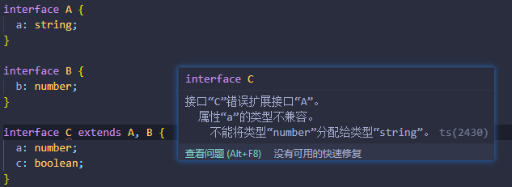
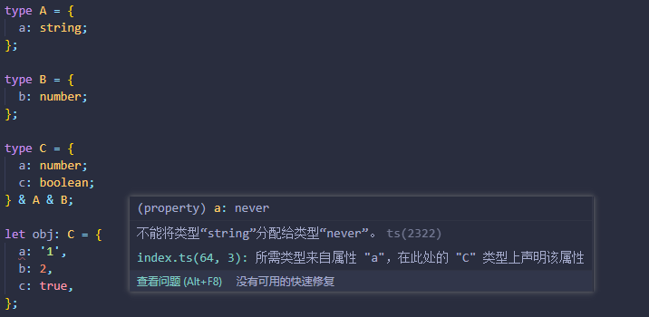
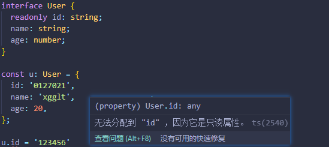

# 接口和类型兼容性


## 接口的概念

TypeScript的接口：用于约束类、对象、函数的契约（标准）

 契约（标准）的形式： 

1. 文档约束，弱标准
   1. 书写文档进行约束，可阅读性较好
   2. 但是，如果开发者误传递API文档的相关参数，则书写代码过程中不会有任何提示，直到运行代码报错
2. 代码约束，强标准
   1. 代码层面进行约束
   2. 开发者正常书写代码即可，如果代码书写不当，TS会及时提示开发者


## 接口的使用

> 接口相关约束代码不会出现在编译结果中

### 约束对象

注意：类型别名和接口在约束对象层面作用类似，二者主要差别在约束类的时候（但推荐尽量使用接口进行约束） 

```typescript
interface User { //定义接口 用于约束对象
  name: string;
  age: number;
}

type User = { //过去我们使用类型别名可以实现类似的效果
  name: string;
  age: number;
};

let u: User = {
  name: 'xgglt',
  age: 20,
};
```

### 约束函数

#### 约束对象方法

```typescript
interface User {
  name: string;
  age: number;
  print: () => void; //方式1
  print(): void; //方式2
}

let u: User = {
  name: 'xgglt',
  age: 20,
  print() {
    console.log('123456');
  },
};
```

#### 直接约束函数

```typescript
//以下两种类型别名的使用方式也能实现相同的效果
// type Condition = (n: number) => boolean;

// type Condition = { //若大括号中没有任何的成员名称，则被视为定界符而不再是对象
//   (n: number): boolean;
// };

interface Condition {
  (n: number): boolean;
}

function randomSum(numbers: number[], callback: Condition) {
  let result = 0;
  numbers.forEach((n) => {
    if (callback(n)) {
      result += n;
    }
  });
  return result;
}

console.log(randomSum([1, 2, 3, 4, 5], (n) => n % 2 === 0)); // 6
```

### 接口继承

**子接口享有父接口中所有的成员**

```typescript
interface A {
  a: string;
}

interface B extends A {
  b: number;
}

let obj: B = {
  a: '1', // B继承了A中所有的成员，因此当obj被限定为B类型时，则需要书写B本身和A中的所有成员才能满足约束
  b: 2,
};
```

**多种接口的组合（继承自多个接口）**

```typescript
interface A {
  a: string;
}

interface B {
  b: number;
}

interface C extends A, B { //继承自多个接口
  c: boolean;
}

let obj: C = {
  a: '1',
  b: 2,
  c: true,
};
```

使用类型别名可以实现类似的组合效果，需要通过`&`,它叫做 交叉类型（可以理解为求并集）

```typescript
type A = { 
  a: string
};

type B = {
  b: number
};

type C = {
  c: boolean 
} & A & B;

let obj: C = {
  a: '1',
  b: 2,
  c: true,
};
```

**注意：二者的区别在于组合出现冲突时，不同的处理方式**

1. 子接口不能覆盖父接口的成员

   

   

2. 交叉类型会把冲突处的成员的类型进行交叉，例如a属性被交叉为了既是string类型又是number类型，则终止判定为never类型（*never类型表示的是那些永不存在的值的类型*）




## readonly修饰符

> 只读修饰符，不在编译结果中

**修饰对象属性**



```typescript
interface User {
  readonly id: string;
  name: string;
  age: number;
}

const u: User = {
  id: '0127021',
  name: 'xgglt',
  age: 20,
};

u.id = '123456'  //无法分配到 "id" ，因为它是只读属性。
```

**修饰数组**

```typescript
// 改变数组的方法，比如push、pop等失效，因为数组是只读的，其内部的值已经被固定下来
// readonly 添加在数组类型约束之前，表示数组其内部元素是只读的，而不是不能给数组重新赋值，若不想让数组能够重新赋值，我们使用const声明数组即可
let arr: readonly number[] = [1, 2, 3, 4, 5];
let arr2: ReadonlyArray<number> = [1, 2, 3, 4, 5]; 
```

```typescript
interface User {
  readonly id: string;
  name: string;
  age: number;
  readonly loves: string[]; //此处readonly修饰的则是对象的loves属性是只读的，不能够被重	新赋值
}

const u: User = {
  id: '0127021',
  name: 'xgglt',
  age: 20,
  loves:['basketball','front-end']
};

u.loves = ['1','2'] //无法分配到 "loves" ，因为它是只读属性。
u.loves.push('1') //该属性是只读的，所以不能被重新赋值，但是可以添加删除成员
```


## 类型兼容性

> B=A	如果能完成赋值，则B和A类型兼容

### 基本类型

基本类型：完全匹配

### 对象类型

1. 鸭子辨型法（子结构辨型法）：目标类型需要某一些特征，赋值的类型只要能满足该特征即可（可以理解为目标类型是将要赋值的类型的子集）

2. 当直接使用对象字面量赋值的时候，会进行更加严格的判断

```typescript
interface Duck {
  sound: '嘎嘎嘎';
  swim: () => void;
}

const person = {
  name: 'xgglt',
  age: 20,
  sound: '嘎嘎嘎' as '嘎嘎嘎', //类型断言 <==> sound: <'嘎嘎嘎'>'嘎嘎嘎',
  swim() {
    console.log('I can swim!');
  },
};

const duck: Duck = person;

//当直接使用对象字面量赋值的时候，会进行更加严格的判断
const duck2: Duck = { 
  name: 'xgglt', //“name”不在类型“Duck”中
  age: 20,
  sound: '嘎嘎嘎' as '嘎嘎嘎', 
  swim() {
    console.log('I can swim!');
  },
};
```

**额外的知识点**

类型断言：在确定类型的情况下，开发者通过as关键字手动指定类型或者在字面量前书写`<指定类型>`

非空断言：在数据之后加上一个`!`，意在告知TS不用考虑该数据为空的情况  

 ```tsx
 import './index.css';
 import { ChessType } from '../../types/enums';
 import Chess from '../Chess';
 import React from 'react';
 
 interface IProps {
   chesses: ChessType[];
   onClick?: (chessIndex: number) => void;
   isGameOver?: boolean;
 }
 
 export const Board: React.FC<IProps> = (props) => {
   // const isGameOver = props.isGameOver as boolean;
   const isGameOver = props.isGameOver!; // 使用非空断言，由于为该属性设置的默认值，则其值不可能为undefined
   const chesses = props.chesses.map((type, index) => (
     <Chess
       key={index}
       type={type}
       onClick={() => {
         !isGameOver && props.onClick && props.onClick(index);
       }}
     />
   ));
 
   return <div className="board-container">{chesses}</div>;
 };
 
 Board.defaultProps = {
   isGameOver: false, //mo
 };
 ```

### 函数类型

函数类型

1. 参数：传递给目标函数的参数可以少，但不可以多（例如`[1,2,3].forEach(这里参数可以只传一个)`）

   ```typescript
   interface Condition {
     (n: number,i:number): boolean;
   }
   
   function randomSum(numbers: number[], callback: Condition) {
     let result = 0;
     numbers.forEach((n,i) => {
       if (callback(n,i)) {
         result += n;
       }
     });
     return result;
   }
   
   console.log(randomSum([1, 2, 3, 4, 5], (n) => n % 2 === 0)); // 1.此处仅传递了一个参数，也不会报错 2.此函数要求返回boolean就必须返回boolean
   ```

2. 返回值：
   1. 要求返回就必须返回，且返回值类型必须匹配

   2. 不要求返回时，则无需返回（若仍然返回了，也不会报错，因为返回了也不会被使用）

      ```typescript
      //callbackfn: (value: number, index: number, array: number[]) => void
      [1, 2, 3].forEach((item) => {
        console.log(item); // 1 2 3
        return true; //不要求返回时,若仍然返回了，也不会报错，因为返回了也不会被使用
      });
      ```

      

